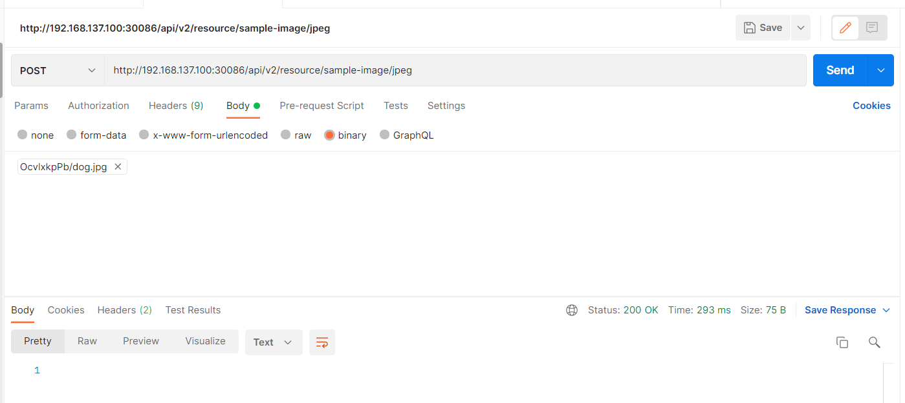
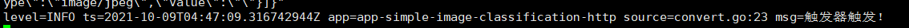
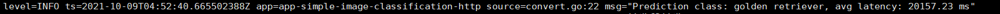

总体上分为三个部分：

- 设置EdgeX触发器，当有图片事件的时候，触发触发器，触发器将图片数据发送给监听程序
- 监听程序：对图片数据进行解析，比如这次是将图像的base64编码解析成RGB数据，并且转换成张量数据发送给推理模型
- 推理端：对收到的数据进行推理，返回推理结果，利用tensorflow serving进行部署，具体参考https://tensorflow.google.cn/tfx/guide/serving

发送图片数据，利用虚拟设备sample-image:

edgex 打印log

显示接收到数据，触发器触发，之后便会发送数据到监听端，然后发送给推理端进行推理，最后返回结果

