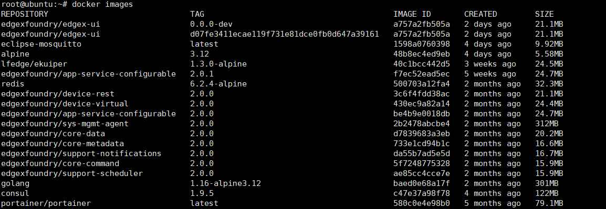
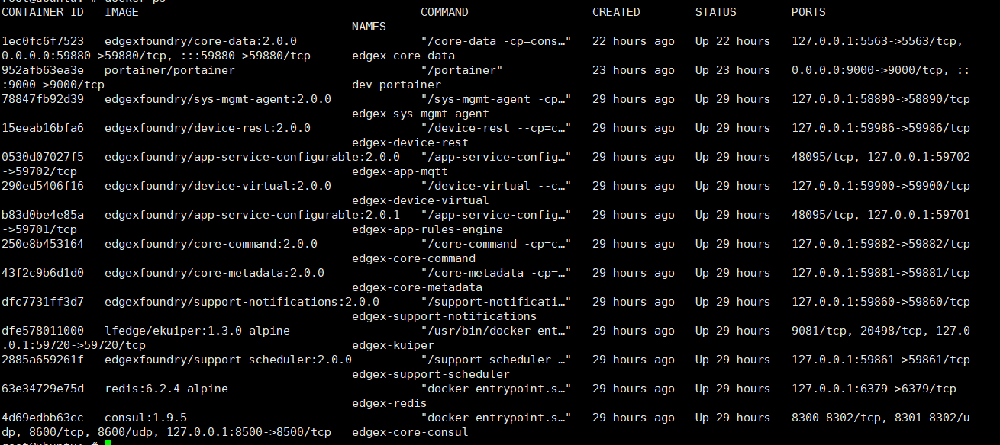

### 基本概念及概念

##### 设备服务层（Device Services）

设备服务层主要负责采集设备的数据，以及根据数据分析结果向设备发送控制命令。

EdgeX设备服务层是如何实现对一个特定设备的数据采集的。例如，现在有一个新的设备，我们希望EdgeX来采集这个设备的数据，该如何操作。

<!--more-->

（1）是不是需要先把这个设备在EdgeX中注册，让EdgeX知道有这个设备？

《edgex-device-service-requirements-v11》

​	由设备服务来完成，DS 至少需要在 Core Metadata 中定义一个 DeviceProfile 来表示它管理的一类设备，该配置文件可以在启动时通过导入 YAML 文件创建，或者在将第一个设备添加到 DS 之前按需创建。 DS 使用设备配置文件在 Core Data 中创建一个或多个 ValueDescriptor。 DS 可以使用从核心元数据读取的预先存在的 DeviceProfile 实例和/或在启动时创建一个或多个新的 DeviceProfile 实例。

​	

​	换句话说，设备服务“包装”了协议通信代码、设备驱动程序/固件和实际设备。

（2）然后呢？如何操作，是EdgeX发送命令给设备，设备收到命令后，就开始发送数据，还是设备和EdgeX注册关联后，就直接开始发送数据？

​	这个问题关键取决于EdgeX想不想要，比如边缘传感器设备它是实时工作的，它只要在工作都会有数据产生，这个时候这些数据最后还是却决于EdgeX需不需要，如果需要我就可以发送命令，也可以设置时间间隔，每隔多长时间我需要一次数据。

（3）设备发送的数据需要是何种格式，是不是需要定义一种数据格式协议？设备按照这个格式协议对数据进行封装，EdgeX收到这些数据后，再按照同样的格式协议对数据包进行解析，这样才能正确理解设备发送过来的数据。那么，这些协议格式是使用现有的，还是要自定义。如果是现有的，那EdgeX支持哪些现有的协议？如果可以自定义，那是不是还要在设备端也开发这种协议的发送端代码？

​	当它摄取传感器数据时，设备服务将“事物”产生和通信的数据转换为通用的 EdgeX Foundry 数据结构，并将转换后的数据发送到核心服务层，以及 EdgeX 其他层的其他微服务。设备发送的数据是什么格式，采用什么协议，应该是由设备生产商负责的，EdgeX只需要知道它采用的什么协议，然后将得到的数据转换为通用的 EdgeX Foundry 数据。如果你是那个设备生产商，现在你采用的是应该全新的协议，显然这些都需要你自己负责。但即使这样设备服务依然不知道你发过来的信息代表着什么，需要在设备配置文件中进行配置。有关于设备类型、设备提供的数据以及如何命令设备都需要在设备配置文件中提供。

（4）如果EdgeX不支持某种设备协议，需要新增该协议，该如何自定义开发，在图中，EdgeX最底层设备服务层的最右边，有个SDK和additional device service，这个是什么功能？是不是用于协议扩展的。

##### 核心服务层（Core Services）

核心层的主要功能是什么？

（1）核心服务层中有Core Data和Meta Data，这些是不是数据库。EdgeX使用的是哪种数据库，为什么要使用数据库对数据进行存储？

​	这些不是数据库，是微服务，通过对数据库的管理服务，现在使用redis，为了数据本地持久化，比如由于网络原因，云端或者企业无法知道现在和过去的温度，通过数据库存储，在网络恢复后，可以知道过去的温度变化。如果不需要持久化，可以直接移除。

（2）核心服务层中有command，这个应该是EdgeX对收到的数据进行分析后，发送的设备控制命令。设备控制命令该用什么格式？将这个格式的命令发送给终端设备后，终端设备就能够理解这个command命令的含义吗？是不是一个设备要想接入EdgeX，还得在这个设备上开发很多协议，像数据发送格式协议，command接受解析协议等，从而使这些终端能够与EdgeX顺利交互。但如何这样的话，每个设备要接入到EdgeX，都需要在该设备上开发一种新的协议，那EdgeX用起来岂不是很麻烦？还是Command命令帧使用的也是现有的一种常见协议定义的格式，而大多数设备都是默认支持该协议功能的，因此，EdgeX发送的command能够直接被设备理解。

​	edgex提供了很多API，可以通过API发送相关命令。

（3）核心服务层除了上面的数据库存储以及command命令下发发送，还有什么功能？Registry & Config模块是什么作用？

​	比如metadata可以负责和设备服务的通信

​	Registry & Config模块应该是负责配置微服务的相关属性（比如位置和状态）

##### 支撑服务层（Supporting Services）

支撑服务层主要是什么功能？

（1）支撑服务层中有Rules engine，就是规则引擎，大概就是运行各式数据处理规则。那么，EdgeX支持哪些规则引擎方法，除了Kuiper规则引擎外，还支持哪些？是不是还支持Drools、Foghorn等？这些规则引擎具体能够执行什么数据处理任务？

​	还支持哪些不清楚

​	现在2.0使用eKuiper规则引擎：https://docs.edgexfoundry.org/2.0/microservices/support/eKuiper/Ch-eKuiper/

​	能够执行什么任务？比如数据过滤，通过SQL来过滤数据管道中的数据，获得想要的一些信息。

（2）支撑服务层中还有Scheduling模块，这个调度是调度什么，有什么作用？

​	提供一个内部EdgeX时钟，可以启动EdgeX服务中的操作，配置的时候可以配置时间间隔，就是每个多长时间做一次什么事情，比如定期进行数据清理

##### 应用服务层

（1）应用服务层是什么功能？

（2）EdgeX与云端的交互，也即将数据发送到云端的操作，是不是由应用服务层来实现？

（3）EdgeX是如何与云端交互的，数据用什么样的协议格式发送给云端？

​	监听数据通道，触发器触发（可以监听一些数据主题），过滤好数据之后（比如要求信息来自于什么设备，需要这个设备的哪些信息），数据转换成json或者XML格式，之后可以调用api特定端口，完成与云端的交互（这是其中的一种方案）。

​	或者就是经过一系列自定义函数，之后返回给数据通道，执行一些内部操作。

（4）如何指定要接受数据的云端目的对象？

​	管道函数内如果调用api接口，可以通过端口指定。

（5）对云端有什么要求，云端是不是要运行一个接受EdgeX数据的程序？支持哪些云服务？华为云，阿里云，还是只能支持指定的几种云？

##### 微服务容器化

在EdgeX架构图的右上方，还存在一个Container deployment，也即容器。

（1）EdgeX是通过docker来实现容器功能的。什么是Docker和容器？Docker和虚拟机又有什么区别？

​	docker pull镜像，然后docker run可以生成一个容器，可以这么理解，容器就是镜像的实例化，docker的文件管理是分层的。

​	docker是安全隔离，而虚拟机是完全隔离的。

（2）为什么EdgeX中要使用容器和docker？有什么好处？什么目的？

​	 速度快，迁移性强，便于部署