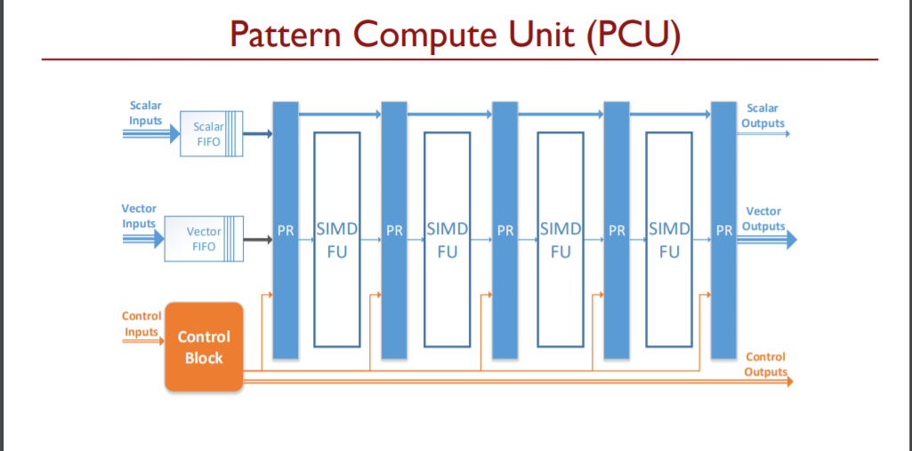

#### Coarse-Grained Reconfigurable Architectures and Plasticine

​	本节课主要介绍了CGRA（粗粒度可重构计算阵列架构）和Plasticine架构。相较于FPGA（现场可编程逻辑门阵列）,它提供可重构阵列的粗粒度设计，可以认为是FPGA Overlay也是FPGA虚拟化的主流技术，可以克服FPGA中的弱重构、功耗高、速度慢等缺点。Plasticine是斯坦福基于CGRA提出的一种体系结构。

​	当今时代三种重要的趋势：

- 大数据，尤其是在机器学习和数据分析领域，这些都极大地增长了计算需求。如下图所示，在2000-2014年，结构性数据呈线性增长，非结构性数据和半结构性数据呈指数型增长。尤其是实时数据挖掘、搜索、分析的发展趋势给计算和存储带来了极大的需求。

  

- 摩尔定律，dennard缩放定律以及功耗墙和存储墙。这使得如何有效地使用晶体管，提高能耗比（性能/功耗）成为了设计专用硬件的关键。随着处理器的发展，单核处理器正向着多核不断发展，但是多核遇到了利用率墙的问题，芯片内可全频率工作的核数受到功率的限制，也就是一开始学习的“暗硅”现象。并且专用处理器无法兼得灵活性和效率，专用处理器效率提升的同时也牺牲了灵活性。

  

- 算法改变迅速，这使得ASIC的设计成本变得巨大，现在的机器学习算法发展的速度很快，每年的论文产量也是比摩尔定律快，一般硬件的设计周期大约两年，对于缺乏灵活性的硬件可能在它设计完成的时候便已经过时了，所以我们需要灵活性高的硬件。

​	一方面，硬件的灵活性是依靠指令集的，但是指令会增加开销，比图取址、译码、寄存器读写等。CPU中40%的数据通路能耗是指令开销，GPU中30%的动态能耗是指令开销。另一方面，可重构硬件也有较高的灵活性，因为它是静态编程没有指令开销，但是可重构的粒度很重要。

​	首先是FPGA，其中包含了大量的门级可重构逻辑单元，并且它们是静态互联的，灵活性高，能耗比高，拥有成熟的工具链。但是FPGA的效率并不高，主要原因是因为其中的互连结构，和专用硬件相比，它的面积、延迟和功耗都相对较高。从可编程性方面来看，细粒度架构导致了较长的布局和路由长度，并且对编译器也不友好。而CGRA则克服了FPGA的这些限制，引入了粗粒度架构，减少了互连，并且采用了新的编译技术。

​	CGRA由计算、内存和互连三部分组成。计算模块由不同能力的ALU构成；内存模块由程序员可控的暂存器、Cache等构成；互连模块由静态可编程的通路或动态路由数据构成。CGRA采用拓扑结构，数据通路层次结构为ALU簇，通信粒度为字级，互连拓扑为网状和环状。编程模型支持软件抽象：线程、VLIW、空间可配置 ALU等，通过编译将高层应用程序映射到CGRA上。

​	CGRA自上而下进行设计，首先我们需要抽象出软件的关键结构用于硬件加速，主要有数据嵌套和流水线并行以及数据局部性。然后是从软件抽象中获取并行模式，例如具有特殊属性的循环；映射、压缩、过滤、分组等；能够通过编译器优化来进行编译。最后设计一个CGRA来加速并行模式。

​	如图是一个点乘的示例，需要将A向量和B向量逐项相乘并相加，左侧是提取的关键计算过程，右侧是CGRA架构实现。

​	首先通过变量i将vecA和vecB加载到输入寄存器中，之后通过变量j来控制最内层的reduce，通过并行度为4的乘法运算后规约运算结果存入acc累加和寄存器，最后进行外层的规约运算，输出结果到out寄存器。

​	接下来是Plasticine Architecture,一种新的可重构架构，用于加速并行并行模式，相比于Altera的Stratix V FPGA拥有95倍的性能表现，功耗提升了75倍。

​	Plasticine的关键特点是：

- 嵌套并行：多级数据通路和灵活的控制机制
- 局部性、内存库、缓冲：有片上暂存器和可配置的内存库以及地址划分的双缓冲
- 密集/稀疏 DRAM 访问：专用DRAM地址生成器/scatter-gather模块
- 标量和矢量通信：多级粒度互连

​	相较于之前的CGRA，Plasticine做到了对并行模式，便笺式暂存，分层互连，可编程性的全支持。

​	Plasticine架构如图所示，主要由地址生成模块、访存合并模块、交换模块、存储模块和计算模块构成。

​	如图所示式PCU的架构，流水线式的SIMD架构，输入有标量、向量和控制信号，输出有标量、向量和控制信号。

​	如图是PCU的整体架构，五段流水线网络，支持前向传播、反向传播、规约运算以及移位操作。

​	PMU模块支持片上地址生成、SRAM阵列块、地址交叉和地址划分；switch模块支持三种粒度的通信，包括标量、向量和控制信号，使用流水交换确保吞吐率；地址生成模块通过整数FU生成DRAM访问地址，支持猝发模式访存和地址流访存。访存合并模块主要有仲裁单元（负责仲裁多路地址流请求）和分散收集单元（负责合并cache的稀疏元数据请求维持cache一致性、合并多个请求为一个DRAM突发、允许大量未完成请求）。

​	应用映射到Plasticine架构的过程如下：首先通过spatial语言编程，循环展开；然后映射至虚拟PCU，包括资源分配，路由和位流生成；最后得到Plasticine位流。

​	参考文献：

​	[Plasticine: A reconfigurable architecture for parallel patterns](https://ieeexplore.ieee.org/abstract/document/8192487)

