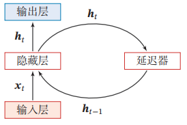

### 第三章 深度学习

#### 3.1 卷积神经网络

​	在做图像处理时，如果采用全连接前馈神经网络来识别，会出现权重参数过多的现象，随着隐层神经元数量的增多，参数的规模也会急剧增加，从而导致整个神经网络训练效率非常低，也很容易出现过拟合。

​	而采用卷积神经网络可以很好地解决上述问题，卷积神经网络是一种具有局部连接、权重共享等特性的深层前馈神经网络。这些特性使得卷积神经网络具有一定程度上的平移、缩放和旋转不变性，从而使得卷积神经网络的参数更少。

##### 3.1.1 卷积神经网络的组成

​	卷积神经网络一般由卷积层、池化层和全连接层组成，最后还会用softmax函数进行分类概率的凸显、抑制以及归一化。

##### 3.1.2 卷积层

​	卷积层的作用是提取一个局部的特征，不同的卷积核相当于不同的特征提取器。浅层神经网络采用全连接方式，计算一个输出需要用到所有输入，而卷积神经网络计算卷积层的一个输出只需要用到$K_r\times K_c$个输入，即卷积核的大小。此外，浅层神经网络中所有神经元的连接都采用不同的权重，因此一个$N_i$输入、$N_o$输出的全连接权重数为$N_i\times N_o$个，而卷积神经网络一堆输入特征图和输出特征图共用一组权重，权重数仅为$K_r\times K_c$个，也就大幅减少了权重的数量。

###### 3.1.2.1 卷积运算

​	卷积神经网络的卷积运算即对输入子矩阵和卷积核做矩阵内积。

###### 3.1.2.2 多输入输出特征图的卷积运算

​	图像中可能有很多种边缘特征，为了提取图像中的不同特征，神经网络需要有多个不同的卷积核去提取多个不同的特征，之后每一个神经网络层输出多个特征图，此时下一层的输入便是多个特征图，这时需要用多个卷积核分别和对应的特征图做卷积运算，最后共同计算出最后的特征图。

###### 3.1.2.3 边界扩充和卷积步长

​	通常情况下，如果不做边界扩充，卷积之后的输出尺寸会被动地略微改变，如果要保证神经网络的输入特征图和输出特征图的尺寸相同，可以进行边界扩充。另外，因为扩充的点都是0，边界扩充还可以强化图像的边缘信息。

​	相反如果希望输出特征图的尺寸有明显变化，可以加大卷积步长，具体可以根据实际的应用需求来调整。

##### 3.1.3 池化层

​	池化层（pooling layer），也称汇聚层和子采样层，可以主动减小图片的尺寸，从而减少参数的数量和计算量，抑制过拟合。常用的池化方法有：最大池化、平均池化、$L^2$池化。

​	最大池化法（Max Pooling）：对一个区域$R^d_m,_n$，选择这个区域内所有神经元的最大活性值作为这个区域的表示，即
$$
y^d_m,_n=\max_{i\in{R^d_m,_n}}x_i,
$$
其中$x_i$为区域$R_k^d$内每个神经元的活性值，通俗的讲，就是在池化窗口内找出最大值作为输出。

​	平均池化法（Mean Pooling）:一般是取区域内所有神经元活性值的平均值，即
$$
y^d_m,_n=\frac{1}{|R^d_m,_n|}\sum_{i\in{R^d_m,_n}}x_i
$$
​	$L^2$池化法是在池化窗口内对所有的数计算平方并累加和后再开方。

##### 3.1.4 全连接层

​	卷积层和池化层构成特征提取器，而全连接层是分类器，全连接层将特征提取得到的高维特征图映射成一维特征向量，最终转化为最终分类为各个类别的概率。

##### 3.1.5 softmax层

​	softmax层对输出进行归一化，输出分类概率，其计算公式为：
$$
f(z_j)=\frac{e^{z_j}}{\sum_{i=0}^{n}e^{z_i}}
$$
​	可以看出，通过归一化计算，可以凸显较大的值并抑制较小的值，从而显著地抑制次要特征，决定分类概率。

#### 3.2 基于卷积神经网络的图像分类算法

##### 3.2.1 AlexNet

​	AlexNet是第一个现代深度卷积网络模型，相对于传统人工神经网络，其首次使用了很多现代深度卷积网络的技术方法：

​	（1）使用GPU进行并行训练

​	（2）Dropout（随机失活）。在训练的过程中随机舍弃部分隐层结点，可以避免过拟合。

​	（3）LRN（局部响应归一化）。LRN的输入是N个不同的特征图，在同一位置上如果包含多个特征，就需要对该位置上的点进行归一化，突出该位置上最显著的特征。后被证明没有实际效果，现在很少使用。

​	（4）MaxPooling（最大池化）。最大池化可以避免特征被平均池化模糊，提高特征的鲁棒性。

​	（5）ReLU激活函数。提高了训练时的收敛速度。

详细可参考论文：Krizhevsky A, Sutskever I, Hinton G E, 2012. ImageNet classification with deep convolutional neural networks[C]

##### 3.2.2 VGG

​	AlexNet使用了8层的神经网络，VGG则使用了更多层的神经网络（最大层数为19层）。

​	VGG使用规则的多层小卷积替代大卷积，在相同视野下，有效减少了权重参数的数量，提高了训练速度；并且在神经网络中使用更多的卷积层及非线性激活函数，提高了图像分类的准确率；提出预训练策略，利用较浅层神经网络训练出来的权重参数来初始化更深神经网络的部分层。

##### 3.2.3 Inception

​	在Inception网络中，一个卷积层包含多个不同大小的卷积操作，称为Inception模块。Inception网络是由有多个Inception模块和少量的池化层堆叠而成。Inception网络有多个版本，其中最著名的就是Inception v1版本，即GoogLeNet，它获得了2014年ImageNet比赛的冠军。其网络结构模型见https://nndl.github.io/v/cnn-googlenet。

​	相对于VGG，GoogLeNet网络层数更深、参数更少、分类精度更高，这主要得益于：

​	（1）$1\times 1$卷积层：将多个输入特征图上相同位置的点做全连接处理，计算出输出特征图上对应位置的一个点，相当于先进行一次特征抽取，可以降低特征图的维度，减少参数数量和计算量。

​	（2）softmax辅助分类器：可以观察训练的中间结果，提前反向传播，从而防止梯度消失。

​	（3）Inception模块，通过引入非常灵活的Inception模块，能让每一层网络适应不同尺度的图像的特性。

​	在GoogLeNet的基础上，BN-Inception在训练中引入了批归一化（Batch Normalization），意思就是对一批数据做归一化，在BN出现之前，归一化操作一般都在数据输入层，对输入的数据进行求均值以及求方差做归一化，但是BN的出现后，我们可以在网络中任意一层进行归一化处理，从而使得当前层的输出靠近中间的区域，输入很小的变化就能显著地体现在损失函数中，从而有效避免了梯度消失的问题。详情见博客：https://www.cnblogs.com/skyfsm/p/8453498.html。

​	Inception-v3网络用多层小卷积核来替换大的卷积核，从而减少计算量和参数量，并保持感受野不变。比如：1）使用两层3×3的卷积来替换v1中的5×5的卷积；2）使用连续的𝐾×1和1×𝐾 来替换𝐾×𝐾 的卷积。此外，Inception-v3网络同时也引入了标签平滑以及批量归一化等优化方法进行训练。

##### 3.2.4 ResNet

​	前面介绍的各种神经网络技术在不断加深神经网络的层数，但是在突破神经网络深度问题上最具有颠覆性的技术还是来自ResNet（残差网络），达到了152层。残差网络通过给非线性的卷积层增加直连边的方式来提高信息的传播效率，其原理需要结合论文《Deep residual learning for image recognition》。

#### 3.3 基于卷积神经网络的图像目标检测算法

##### 3.3.1 R-CNN（区域卷积神经网络）

​	R-CNN主要包括四个步骤：

​	（1）候选区域提取：通过选择性搜索从原始图片中提取2000个左右的候选区域。

​	（2）特征提取：将所有候选区域裁剪缩放为固定大小，再对每个候选区域用AlexNet提取出4096维的图像特征。

​	（3）线性分类：用特定类别的SVM（Supported Vector Machine，支持向量机）对每个候选区域做分类。

​	（4）边界框回归：用线性回归来修正边界框的位置和大小，其中每个类别单独训练一个边界框回归器。

​	R-CNN存在以下几个主要缺点：

​	（1）重复计算：2000个候选框都需要做卷积神经网络处理，计算量特别大，候选框之间很可能有较多的重叠部分，这些部分都会重复计算，增大了计算量。

​	（2）SVM分类：在标注数据足够多的时候，用卷积神经网络做图像分类比SVM更为准确。

​	（3）训练测试步骤多：计算过程中的很多中间数据需要单独保存，数据需要反复读写，效率低。

​	（4）检测速度慢：重复计算和反复读写造成了耗时多，检测速度慢。

​	为了解决上述问题，分别有Fast R-CNN和Faster R-CNN的提出。

##### 3.3.2 YOLO（You Only Look Once）

​	YOLO使用统一检测模型，将目标分类和定位用一个神经网络统一起来，实现了端到端的目标检测，可以满足实时性应用要求。

​	相对于传统目标检测，有如下优点：

​	（1）检测速度快：YOLO将目标检测重建为单一回归问题，对输入图像直接处理，输出目标位置以及分类概率。

​	（2）背景误判少：YOLO在训练和测试时每个格子都可以看到全局信息，减少背景误判。

​	（3）泛化性好：YOLO能够学习到目标的泛化表示，能够迁移到其他领域。

​	虽然YOLO的检测速度很快，但是精度不高，主要是因为每个格子只能预测两个边界框和一种目标的分类，如果多个物体的中心在同一个格子内，就会丢失其他类别的物体；并且损失函数设计过于简单；模型不易训练。

##### 3.3.4 SSD（Single Shot Detector，单次检测器）

​	SSD的主要思想是：在不同大小的特征图上都提取默认框做检测，以找到最合适的默认框的位置和大小。在比较大的特征图上检测比较小的目标，在比较小的特征图中检测比较大的目标。

​	SSD 使用卷积网络中较深的层来检测目标，导致图像的分辨率显著降低，可能已无法定位在低分辨率中难以检测的小目标。

#### 3.4 序列模型：循环神经网络

​	循环神经网络是一类具有短期记忆能力的神经网络，在循环神经网络中，神经元不仅可以接受其他神经元的信息，还可以接受自己的信息，形成具有环路的网络结构。循环神经网络主要用于机器翻译、图片描述、视频标注、视觉问答等。

​	下图是一个循环神经网络，其输入是$x$，输出为$\hat{y}$，隐层为$h$，隐层$h$称为记忆单元，具有存储信息的能力，其输出会影响下一时刻的输入。

​	循环神经网络通过下面的公式更新带反馈边的隐藏层的活性值𝒉𝑡：
$$
h_t=f(h_{t-1},x_t)
$$
​	RNN的训练一般采用一种变种的反向传播算法，学名为基于时间的反向传播，核心是将RNN按时间展开后做反向传播。BPTT完成正向传播后一般用交叉熵作为损失函数，然后做梯度下降。

​	由于RNN很容易出现梯度消失或梯度爆炸，RNN只能学到很短期的依赖关系，可以使用现在流行的长短期记忆模型（LSTM）和门限循环单元（GRU）。

#### 3.5 生成对抗网络

​	目前最常见的两类深度学习算法是处理图像信息的卷积神经网络和处理序列信息的循环神经网络。这两类神经网络的共同特点是需要大量的训练样本。如何用少量样本去训练出准确的神经网络，由此便有了生成对抗网络（Generative Adversarial Net，GAN）。

​	生成对抗网络由生成网络和对抗网络组成。生成网络相当于伪装者，会通过不断学习生成足够以假乱真的样本，而判别网络相当于鉴定师，会判断该样本到底是真样本还是假样本。双方通过不断辩论，提升彼此的能力。用我自己的理解就是生成对抗网络相当于矛盾，一方生产能够刺穿一切盾的矛，一方生产足够抵挡一切矛的盾，双方在不断博弈的过程中，达到提升自己的能力，从而整个网络能力不断提高。

​	GAN大致可分为：卷积GAN、条件GAN、集成预测模型的GAN、对抗自编码器。对应GAN的学习需要在日后的实际应用中深入学习。