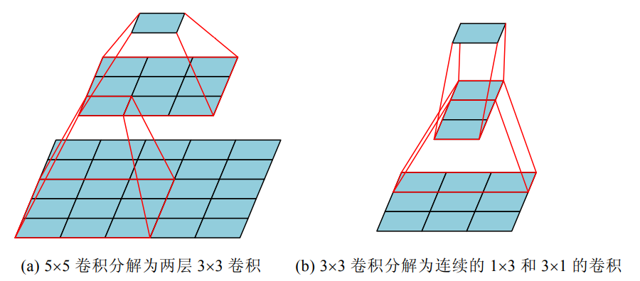
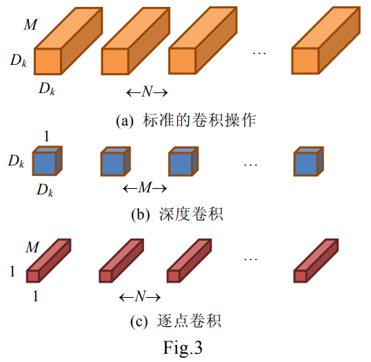

#### 1. 人工设计的轻量级神经网络模型

##### 1.1 使用小卷积核代替大卷积

​	使用多层小卷积核代替一层大卷积核，可以减少网络的参数。如图所示：

例如使用两层3×3的卷积核代替5×5的卷积核，其卷积核的参数量可以从25减少到18，对于输入大小为 H×W×Cin 的特征,输出为 H×W×Cout 大小的特征图时，其浮点运算数从H×W×Cin×Cout×5²减少到了2×H×W×Cin×Cout×3。对于图b使用1×3核3×1的卷积核代替3×3的卷积核，可以使得参数量减少为原来的1/3。

##### 1.2 限制中间特征的通道数量

​	Fire model:[《SQUEEZENET: ALEXNET-LEVEL ACCURACY WITH 50X FEWER PARAMETERS AND <0.5MB MODEL SIZE》](https://arxiv.org/pdf/1602.07360.pdf?source=post_page---------------------------)

​	如图，核心思想就是通过许多的fire model模块替代原来的conv+pool，具体包含两个部分：压缩(squeeze)层和扩张(expand)层。其中的squeeze层是卷积核为1×1的卷积层，后面的expand层是由1×1以及3×3的两个卷积层共同构成的。

##### 1.3 分解卷积运算

​	例如利用深度可分离卷积对Mobile V1的标准卷积进行分解。标准卷积的计算量为$D_k×D_k×M×N×H×W$,而深度可分离卷积的计算量为$D_k×D_k×M×H×W+  M×N×H×W$,计算量大幅缩小

​	

还有一些其他的卷积分解操作见https://blog.csdn.net/weixin_40004659/article/details/111637585。

#### 2. 卷积神经网络的压缩算法

##### 2.1 基于规则的神经网络模型压缩

- 权重裁剪
- 权重量化
- 低秩分解
- 知识蒸馏

##### 2.2 基于自动机器学习的自动神经网络模型压缩

​	通过设计一系列的控制器操作机器学习模型,使得模型可以自动地学习到合适的参数和网络架构而不需人工的干预,减少对专业知识和领域知识的要求,从而降低设计机器学习算法的难度。

​	以AMC算法（[AMC: AutoML for Model Compression and Acceleration on Mobile Devices](https://arxiv.org/pdf/1802.03494.pdf)）为例，与传统的在离散空间上进行搜索不同，AMC算法采用 DDPC代理的连续压缩比控制策略，通过优化损失函数学习模型压缩策略。特别地,  DDPC代理以分层的方式处理神经网络，对于每一层 Lt，代理接受编码该层的有用特征 St，然后输出精确压缩比。第 Lt 层压缩完成后，代理移动到下一层 Lt+1，在没有微调的情况下，对压缩后的神经网络中的所有层的精度进行评估。

AMC模型通过强化学习算法来训练代理，实现动作的预测并计算稀疏性，执行压缩。同时快速评估压缩后的模型性能，通过优化损失函数更新代理。

#### 3. 基于神经网络架构搜索的自动化轻量级神经网络设计

​	神经网络架构搜索（NAS）是指根据某种搜索策略，在特定的搜索空间内，自动设计出解决特定任务的高性能神经网络架构。

​	NAS由三部分组成，分别是搜索空间、搜索策略和性能评估策略。

- 搜索空间：定义了构建神经网络的基本架构单元，将适合该任务的典型网络架构作为先验知识，从而减少搜索空间的大小（该过程可能会引入人为因素，从而收到干扰）。
- 搜索策略：决定如何搜索用于解决该任务的神经网络架构，并决定网络中不同层，不同模块的连接方式和参数。
- 性能评估策略：准确高效地评价神经网络的性能。

​    如图为神经网络搜索的流程图，搜索策略从搜索空间中选择神经网络架构A，通过性能评估策略评价神经网络架构的性能，作为奖励反馈给搜索策略，搜索策略根据接收到的奖励调整神经网络架构，通过不断的迭代，最终获得最佳的神经网络架构。

