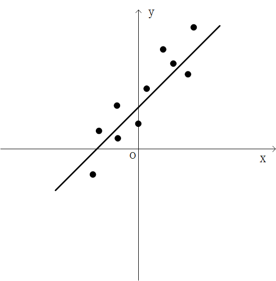
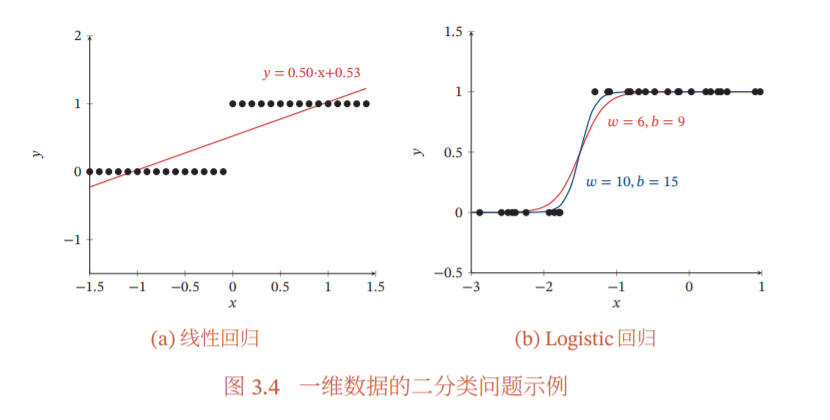

##### 为什么平方损失函数不适用于分类问题？

​	在Softmax激活函数的作用下，使用平方损失函数，随着实际值与预测值的绝对误差的不断增大，梯度反而会不断减小，这就使得调整参数的速度减慢，不利于快速收敛。

<!--more-->

##### 如何理解最小二乘法与最大似然估计？

​	

​	如图所示，线性回归中我们的任务是找到一条直线来拟合图中的这些样本点，现实中，样本点的维数是不会只有1维的，可以是多个维度，所以我们令样本的维数为p，则有如下两个向量：
$$
x_i=\left[
 \begin{matrix}
   1  \\
   x_{i1} \\
   x_{i2} \\
   x_{i3} \\
   \vdots \\
   x_{ip}
  \end{matrix}
  \right]
  \space\space\space
  w=\left[
 \begin{matrix}
   w_0  \\
   w_1 \\
   w_2 \\
   w_3 \\
   \vdots \\
   w_{p}
  \end{matrix}
  \right]
$$
这里将偏置$b$记为$w_0$，所以最终的映射关系就写为$y=w^Tx$.

在最小二乘法中，我们定义了如下的损失函数：
$$
L(W)=\sum_{i=1}^{N}|w^Tx_i-y_i|^2
$$
其目标就是要找到一组向量$w$，使得最终拟合出来预测值与真实值之间的误差的平方最小，由此得出最佳的拟合结果。

​	以上面图的例子为例，我们是否可以找到一条直线让其精准地通过图上所有的样本点，显然这是不可能的。样本数据本身是带有噪声的，也就是带有随机性，所以这就造成了样本点都围绕着直线的上下，而其中的误差便是噪声，也是随机性。这里就引入了高斯噪声，我们令噪声$\epsilon$服从均值为0，方差为$\sigma^2$的一维高斯分布，此时
$$
\epsilon \sim N(0,\sigma^2)
$$
于是有
$$
y=w^Tx+\epsilon
$$
此时
$$
y \sim N(w^Tx,\sigma^2)
$$
写成概率密度的形式为
$$
p(y|x;w)=\frac{1}{\sqrt{2\pi}\sigma} \exp\lbrace-\frac{(y-w^Tx)^2}{2\sigma^2}\rbrace
$$
于是对于N个独立同分布的训练集D，我们利用极大似然估计去估计参数$w$。

接下来解释一下什么是极大似然估计，通俗地讲就是根据既定事实去推断参数，极大似然函数就是关于参数的函数，极大似然估计就是找到能够符合当前事实概率最大的参数。

参数$w$在训练集D上的对数似然函数为
$$
L(w)=log\prod_{i=1}^{N}p(y_i|x_i;w)=\sum_{i=1}^Nlogp(y_i|x_i;w)
$$
目标是指找到一组参数𝒘使得似然函数 𝑝(𝒚|𝑿; 𝒘) 最大，也就是使得对数似然函数最大。

​	最终待估计的蚕食$w$的极大似然估计值是：
$$
w_{mle}=argmax_u\sum_{i=1}^N(log\frac{1}{\sqrt{2\pi}\sigma}-\frac{(y_i-w^Tx_i)^2}{2\sigma^2})
$$
去掉与$w$无关的常数项，最终得到：
$$
w_{mle}=argmax_u\sum_{i=1}^{N}-(y_i-w^Tx_i)^2=argmin_u\sum_{i=1}^{N}(y_i-w^Tx_i)^2
$$
由此便得到了最小二乘法的定义式，上式化简可以得到
$$
L(w)=(w^TX^T-Y^T)(Xw-Y)=w^TX^TXw-2w^TX^TY+Y^TY
$$
对$w$求偏导，令
$$
\frac{\partial}{\partial w}L(w)=\frac{\partial}{\partial w}(w^TX^TXw-2w^TX^TY+Y^TY)=2X^TXw-2X^TY=0
$$
得到：$X^TXw=X^TY$,从而有$w=(X^TX)^{-1}X^TY$

这里让我想到一个问题，如开始的图中所示，看到这样的样本数据分布，确实第一个想到的就是线性回归模型，样本数据在拟合的直线上下波动，我们可以假定为噪声的影响，但并非所有的场景线性回归模型都适合，如何样本数据分布近似一条曲线，我们却用线性回归模型去训练，最终得出的也是样本点在直线上下波动，当然此时的波动就大了，显然我们不可以将这些误差全然视为噪声，此时我们可以选择使用别的模型，例如多项式回归模型，从理论上来说，通过泰勒定理，任何函数都可以通过泰勒级数逼近。

##### 线性回归模型为什么不适合分类问题？

​	首先线性回归模型并非不能用于分类问题，最小化平方损失函数本质上等同于在误差服从高斯分布下的极大似然估计，这个在前面已经得到证明，对于一些分类任务，只需要设置一个合适的阈值就可以进行分类，但是大部分分类任务的误差并不服从高斯分布，使用线性回归模型稳定性很差，在样本分布较为复杂时，无法进行准确分类。

​	如下图所示的二分类问题，我们可以使用线性函数去解决分类问题，真实值只有两个可能的值，即0和1，我们当然可以人为设置当x满足使得y=0.5x+0.53大于0.53时，则预测值为1，当小于0.53时，则预测值为0来完成分类任务，但这也仅仅适合分布较为简单的情况。同样，我们可以使用激活函数，图中所示为sigmod函数（函数平滑，并且有利于求导），将线性回归预测值压缩到（0，1）之间，以此表示预测标签的概率，图中我们可以选取0.5为分界线，当概率大于0.5，我们认为预测值为1，当概率小于0.5，我们认为预测值为0，当前分界线可以认为设定，对于高可靠性的任务场景，我们可以将分界线设置地较高，以满足任务需求。

