##### 如何理解反向传播？

​	首先介绍一下什么是梯度下降法。以神经网络为例，给定一组神经网络参数，即
$$
\theta=\{w_1,w_2,...,b_1,b_2,...\}
$$
记
$$
\nabla L(\theta)=\left[\begin{matrix}
\frac{\partial L(\theta)}{\partial w_1} \\
\frac{\partial L(\theta)}{\partial w_2} \\
\vdots \\
\frac{\partial L(\theta)}{\partial b_1} \\
\frac{\partial L(\theta)}{\partial b_2} \\
\vdots
\end{matrix}\right]
$$
通过计算$\nabla L(\theta^0)$，得到$\theta^1=\theta^0-\eta\nabla L(\theta^0)$，通过计算$\nabla L(\theta^1)$，得到$\theta^2=\theta^1-\eta\nabla L(\theta^1)$，不断反复，最后找到最佳参数。与线性回归，逻辑回归不同的是，神经网络中往往参数量是百万级别的，如何有效率地计算梯度，这便是反向传播的作用。

​	这里先介绍一下链式法则，如书中附录部分：

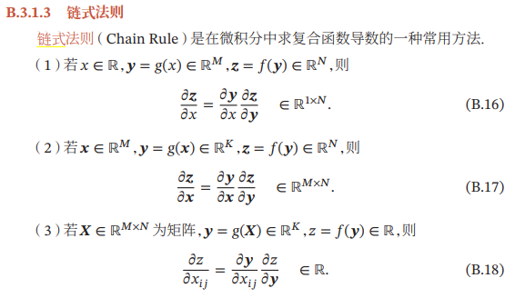

以B.16为例，$\Delta x\rightarrow\Delta y\rightarrow\Delta z$，于是我们有$\frac{\partial z}{\partial x}=\frac{\partial z}{\partial y}\frac{\partial y}{\partial x}$。

还有一种情况就是$x=g(t),y=h(t),z=k(x,y)$，此时$$\frac{\partial z}{\partial t}=\frac{\partial z}{\partial x}\frac{\partial x}{\partial t}+\frac{\partial z}{\partial y}\frac{\partial y}{\partial t}$$

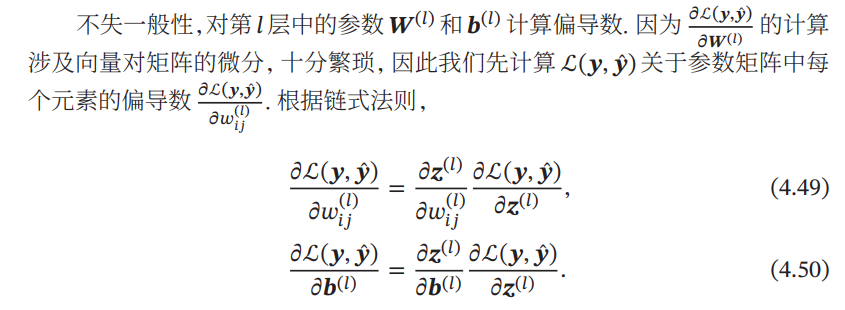

这里为了说明方便，我们截取特定输入样本的某一层的某个神经元进行说明。这里只介绍$\frac{\partial C}{\partial w}$，因为计算$\frac{\partial C}{\partial b}$的原理是一样的。
$$
L(\theta)=\sum_{n=1}^NC^n(\theta)\rightarrow \frac{\partial L(\theta)}{\partial w}=\sum_{n=1}^{N}\frac{\partial C(\theta)}{\partial w}
$$
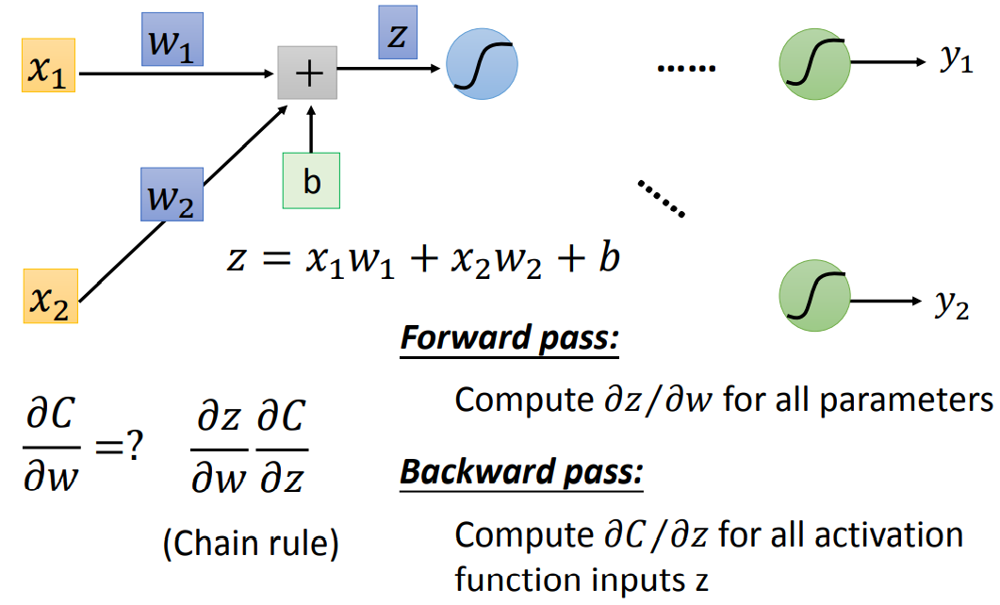

显然前面的这一项$\frac{\partial z}{\partial w}$非常容易计算，如图中所示，$$\frac{\partial z}{\partial w_1}=x_1 , \frac{\partial z}{\partial w_2}=x_2$$，**其结果就是连接这个权重的输入**，我们称这个过程为顺推法。而计算$\frac{\partial C}{\partial z}$就比较复杂了，如下图所示：

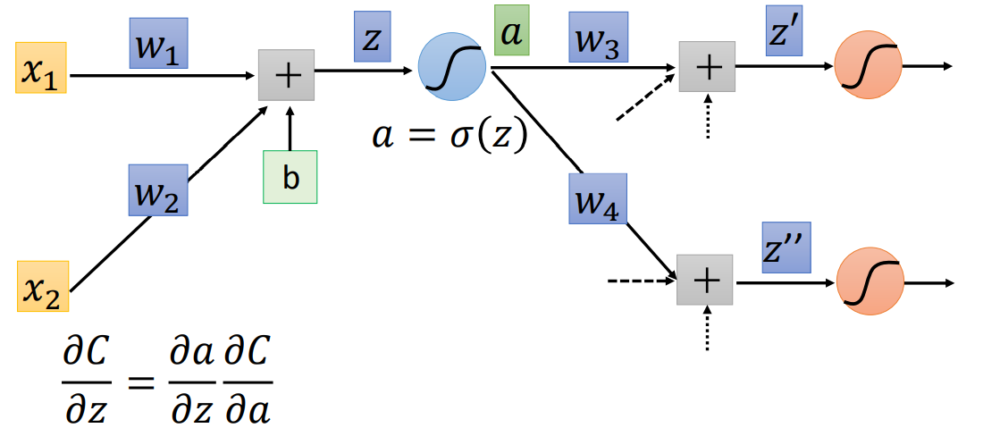

我们知道$\frac{\partial a}{\partial z}=\sigma'(z)$，接下来就是计算$\frac{\partial C}{\partial a}$，图中通过链式法则我们可以得到，复杂的情况下，下面可能会产生很多项：
$$
\frac{\partial C}{\partial a}=\frac{\partial z'}{\partial a}\frac{\partial C}{\partial z'}+\frac{\partial z''}{\partial a}\frac{\partial C}{\partial z''}
$$
其中的$\frac{\partial z'}{\partial a}$和$\frac{\partial z''}{\partial a}$很容易计算，就是$w_3$和$w_4$，此时我们得到：
$$
\frac{\partial C}{\partial z}=\sigma'(z)[w_3 \frac{\partial C}{\partial z'}+w_4\frac{\partial C}{\partial z''}]
$$
上述公式可以看出如下的类似的反向神经网络，其中$\sigma'(z)$是一个常量，因为在前向传播中，z的值已经被计算出来，带入即可得到其值。

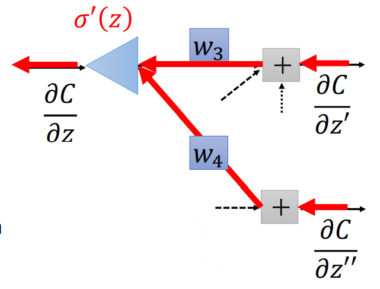

现在所有的问题都集中在如何计算$\frac{\partial C}{\partial z'}$和$\frac{\partial C}{\partial z''}$，会遇到两种情况，第一种就是$z',z''$已经到达输出层，如图所示：

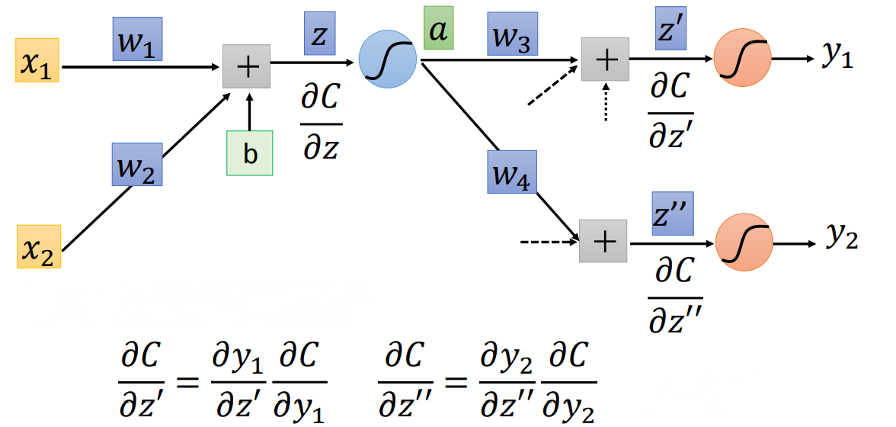

这两项都可以直接计算得出，因为你知道最后的激活函数，你也知道你的损失函数是怎么定义的。

还有一种情况就是$z',z''$只是在中间的隐藏层，后面还有许多层，如图所示：

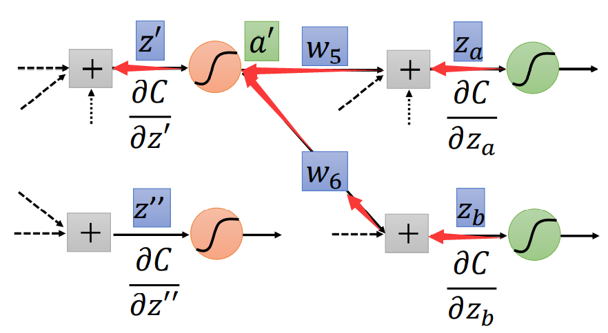

我们发现计算$\frac{\partial C}{\partial z'}$和$\frac{\partial C}{\partial z''}$与之前计算$\frac{\partial C}{\partial z}$一样，例如:
$$
\frac{\partial C}{\partial z'}=\frac{\partial a'}{\partial z'}\frac{\partial C}{\partial a'}=\sigma'(z')[\frac{\partial z_a}{\partial a'}\frac{\partial C}{\partial z_a}+\frac{\partial z_b}{\partial a'}\frac{\partial C}{\partial z_b}]=\sigma'(z')[w_5 \frac{\partial C}{\partial z_a}+w_6\frac{\partial C}{\partial z_b}]
$$
接下来就是无线套娃的过程，这里我们如果一直从前往后推这是非常复杂的过程，但如果我们一开始就从后往前计算，整个过程就变得很简单，这便是反向传播。如图所示，如果我们要计算$\frac{\partial C}{\partial z_1}$，正向计算我们需要算$\frac{\partial C}{\partial z_3},\frac{\partial C}{\partial z_4},\frac{\partial C}{\partial z_5},\frac{\partial C}{\partial z_6}$，而想要得到$\frac{\partial C}{\partial z_3}$，我们需要计算$\frac{\partial C}{\partial z_5},\frac{\partial C}{\partial z_6}$，以此类推，图中所给示例还是比较简单的结构，如果复杂一点，计算量可想而知。

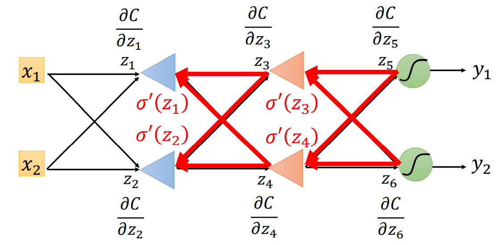

而现在，我们从后面往前算，先计算$\frac{\partial C}{\partial z_5},\frac{\partial C}{\partial z_6}$，再根据$\frac{\partial C}{\partial z_5},\frac{\partial C}{\partial z_6}$计算$\frac{\partial C}{\partial z_3},\frac{\partial C}{\partial z_4}$，再根据$\frac{\partial C}{\partial z_3},\frac{\partial C}{\partial z_4}$，计算$\frac{\partial C}{\partial z_1},\frac{\partial C}{\partial z_2}$.

总结一下反向传播的过程就是先顺推出例如$\frac{\partial z}{\partial w}$的值，然后逆推出$\frac{\partial C}{\partial z}$,最终便可以得到$\frac{\partial C}{\partial w}=\frac{\partial z}{\partial w}\frac{\partial C}{\partial z}$.

##### 自动梯度计算

这个部分可以参考论文[《Automatic Differentiation in Machine Learning: a Survey》](https://arxiv.org/pdf/1502.05767.pdf)

- 数值微分

  数值微分（Numerical Differentiation）是用数值方法来计算函数𝑓(𝑥)的导数。函数𝑓(𝑥)的点𝑥的导数定义为
  $$
  f'(x)=\lim_{\Delta x\rightarrow0}\frac{f(x+\Delta x)-f(x)}{\Delta x}
  $$
  找到一个合适的扰动 Δ𝑥十分困难。如果 Δ𝑥 过小，会引起数值计算问题，比如舍入误差；如果Δ𝑥 过大，会增加截断误差，使得导数计算不准确。因此，数值微分的实用性比较差。

  何为截断误差？例如函数$e^x$可以展开为无穷幂级数：
  $$
  e^x=1+x+\frac{x^2}{2!}+\frac{x^3}{3!}+\frac{x^4}{4!}+\dots
  $$
  若取其中的部分项比如:
  $$
  e^x\approx 1+x+\frac{x^2}{2!}
  $$
  作为其近似计算公式，于是后面的项便舍弃了，便产生了误差，这就是**截断误差**。

  书中说使用下面公式来计算梯度，可以减少截断误差，也称中心差分：
  $$
  f'(x)=\lim_{\Delta x\rightarrow0}\frac{f(x+\Delta x)-f(x-\Delta x)}{2\Delta x}
  $$
  利用python程序进行验证：

  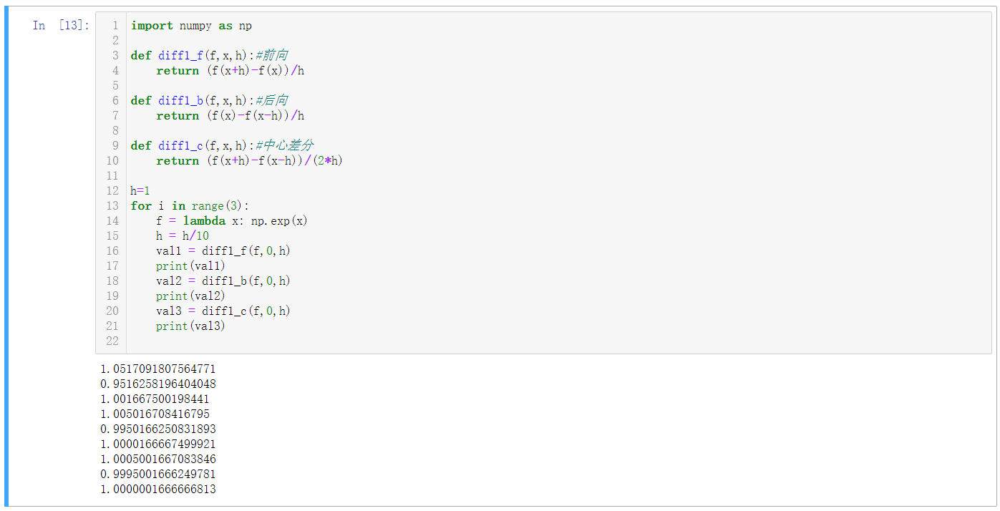

  | $f(x)=e^ x$ | h=0.1              | h=0.01             | h=0.001            |
  | ----------- | ------------------ | ------------------ | ------------------ |
  | 前向差分    | 1.0517091807564771 | 1.005016708416795  | 1.0005001667083846 |
  | 后向差分    | 0.9516258196404048 | 0.9950166250831893 | 0.9995001666249781 |
  | 中心差分    | 1.001667500198441  | 1.0000166667499921 | 1.0000001666666813 |

- 符号微分

  符号微分可以利用代数软件自动实现一些微分的公式，比如：
  $$
  \frac{d}{dx}(f(x)+g(x)) \leadsto \frac{d}{dx}f(x)+\frac{d}{dx}g(x)
  $$
  
  $$
  \frac{d}{dx}(f(x)g(x))\leadsto(\frac{d}{dx}f(x))g(x)+f(x)(\frac{d}{dx}g(x))
  $$
  
  符号微分有一些不足之处：1）编译时间较长，特别是对于循环，需要很长时间进行编译；2）为了进行符号微分，一般需要设计一种专门的语言来表示数学表达式，并且要对变量（符号）进行预先声明；3）很难对程序进行调试。
  
  同时，符号微分还存在表达式膨胀（ expression swell）的问题，如表所示：
  
  

- 自动微分（Automatic Differentiation，AD）

  以复合函数$f(x;w,b)$为例：
  $$
  f(x;w,b)=\frac{1}{\exp(-(wx+b))+1}
  $$
  将其分解为一系列基本操作，并且构成一个计算图，计算图中的每个非叶子节点表示一个基本操作，每个叶子节点为一个输入变量或常量。下图给出了当 𝑥 = 1, 𝑤 = 0, 𝑏 = 0 时复合函数$f(x;w,b)$的计算图：

  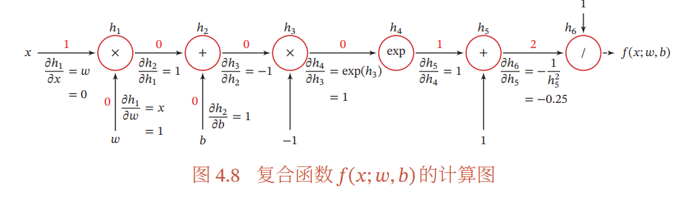

  可以看出该函数由6个基本函数组成，如下表所示：

  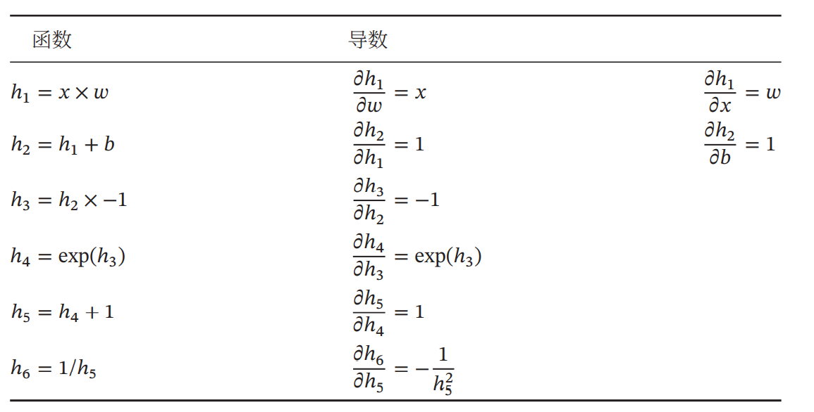

  通过计算图上与参数$w$和$b$有关的路径可以得到函数$f(x;w,b)$关于参数$w$和$b$的导数：

  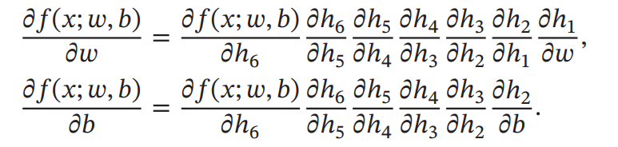

  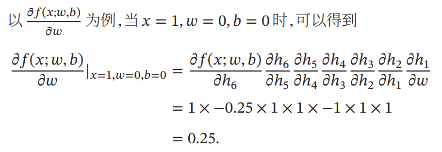

  前向模式：与计算图计算方向相同递归地计算梯度，其过程如下：
  $$
  \begin{align*}
  &\frac{\partial h_1}{\partial w}=x=1	\\
  &\frac{\partial h_2}{\partial w}=\frac{\partial h_2}{\partial h_1}\frac{\partial h_1}{\partial w}=1 \times 1=1 \\
  &\frac{\partial h_3}{\partial w}=\frac{\partial h_3}{\partial h_2}\frac{\partial h_2}{\partial w}=-1\times 1=-1 \\
  &\frac{\partial h_4}{\partial w}=\frac{\partial h_4}{\partial h_3}\frac{\partial h_3}{\partial w}=\exp(h3)\times -1=1\times -1=-1 \\
  &\frac{\partial h_5}{\partial w}=\frac{\partial h_5}{\partial h_4}\frac{\partial h_4}{\partial w}=1\times-1=-1\\
  &\frac{\partial h_6}{\partial w}=\frac{\partial h_6}{\partial h_5}\frac{\partial h_5}{\partial w}=-0.25\times-1=0.25\\
  &\frac{\partial f(x;w,b)}{\partial w}=\frac{\partial f(x;w,b)}{\partial h_6}\frac{\partial h_6}{\partial w}=1\times0.25=0.25
  \end{align*}
  $$
  反向模式：与反向传播的计算方式相同，可以说反向传播是反向模式的一种特殊形式。

  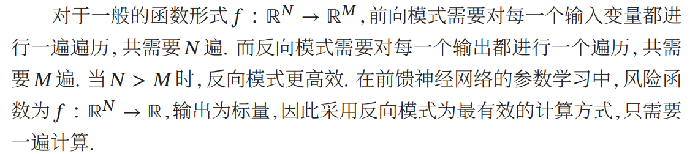

  如何理解？对于像神经网络这种模型，通常输入是上万到上百万维，而输出损失函数是一维的模型，只需要一遍反向模式的计算过程，便可以求出输出对于各个输入的导数，从而轻松求取梯度用于后续优化更新。

##### 如何理解通用近似定理(如何理解神经网络)？

​	如图所示，现在有如下函数需要我们去拟合，显然这条红色的折线段可以表示为：红色线=多个分段函数累加+常量（偏置）

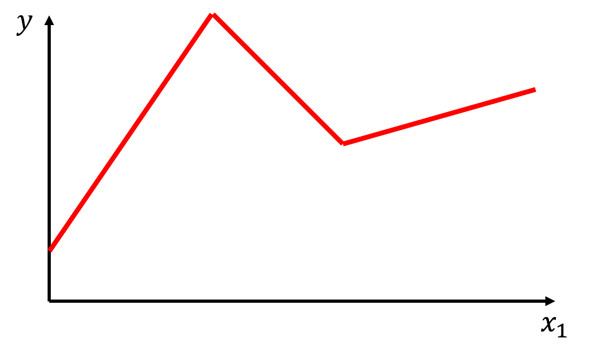

​	如图所示，红色折线段可以由**蓝色线段0（常量偏置）+蓝色线段1+蓝色线段2+蓝色线段3**合成。

​	通过这个例子我们可以知道任意的分段线性函数可以由一个常量+多个如图所示的蓝色函数组成，只是不同的分段线性函数所用的蓝色函数不一定相同。

​	当然实际我们遇到的函数困难如下图所示，是一条连续的曲线，我们依然可以用多条直线段合成去逼近这条曲线（只要我们绿色的点取的足够的多），这里也就告诉我们只要蓝色的函数足够地多，那么任意一条曲线我们都可以去逼近。

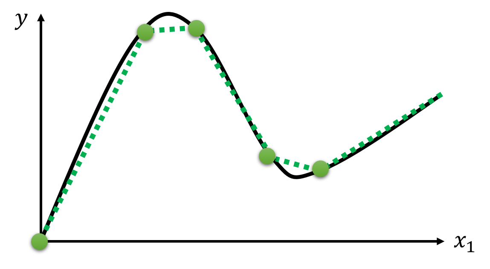

​	那么现在的问题就是我们怎么去表示这些蓝色的函数，如下图所示，如果用分段函数的形式去表示，结构有一些复杂，仔细观察，这样的函数非常像sigmoid函数，如下图所示：

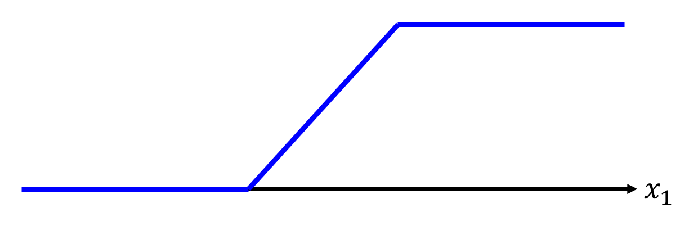

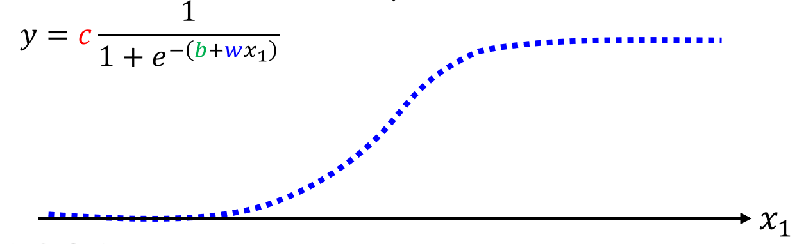

所以我们可以用形如：$y=c\frac{1}{1+e^{-(b+wx_1)}}$的曲线（平滑，易于求导）去逼近上述蓝色的分段函数（这里我们称之为“Hard Sigmoid”），现在我们的目标就是用sigmoid函数去逼近各种各样的蓝色分段函数。

​	此时我们只需要调整参数值，就可以得到不同的sigmoid函数，总结一下，整体的流程就是：通过各种的sigmoid函数去逼近各种各样的hard sigmoid(蓝色函数)，通过多个hard sigmoid合成得到线性分段函数，用线性分段函数去近似各种的连续函数。

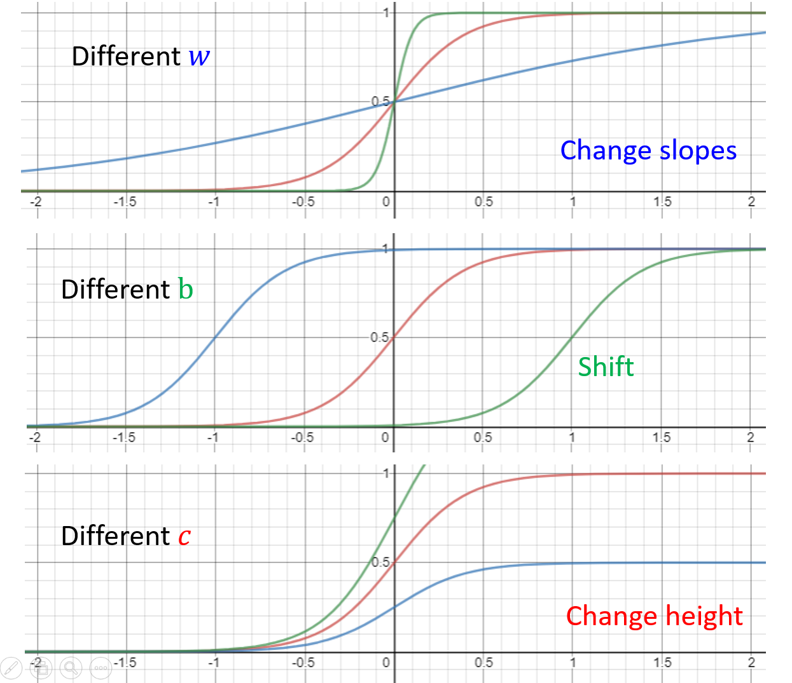

​	来看刚刚的例子，如图所示，这条红色的线性分段函数便可以用如下的形式去拟合：
$$
y=b+\sum_ic_isigmoid(b_i+wix_1)
$$
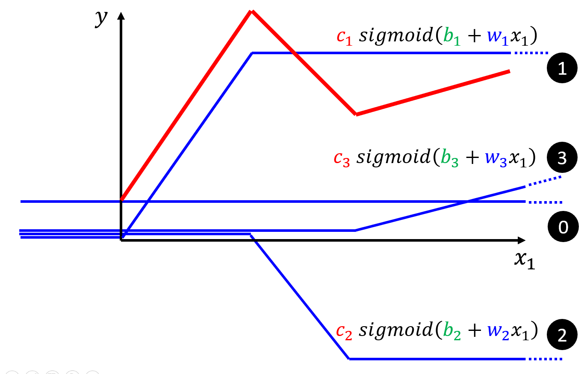

这里出现了**通用近似定理**的雏形，想对于之前的只有一个特征的线性回归模型$y=b+wx_1$，此处的模型变得更有弹性。如果线性模型变为多维特征输入，形如：
$$
y=b+\sum_jw_jx_j
$$
我们同样可以用如下的模型去拟合：
$$
y=b+\sum_ic_isigmoid(bi+\sum_jw_{ij}x_j)
$$
这个就是通用近似定理给出的形式。上面的公式拆解一下，就变成了神经网络的形式。现在我们只关注$sigmoid(bi+\sum_jw_{ij}x_j)$，我们假定i=1，2，3；j=1,2,3，可以有
$$
\begin{align*}
&r_1=b_1+w_{11}x_1+w_{12}x_2+w_{13}x_3\\
&r_2=b_2+w_{21}x_1+w_{22}x_2+w_{23}x_3\\
&r_3=b_3+w_{31}x_1+w_{32}x_2+w_{33}x_3\\
\end{align*}
$$
也就是：
$$
\left[\begin{matrix}
r_1\\
r_2\\
r_3
\end{matrix}\right]=
\left[\begin{matrix}
b_1\\
b_2\\
b_3
\end{matrix}\right]+
\left[\begin{matrix}
w_{11}&w_{12}&w_{13}\\
w_{21}&w_{22}&w_{23}\\
w_{31}&w_{32}&w_{33}\\
\end{matrix}\right]
\left[\begin{matrix}
x_1\\
x_2\\
x_3
\end{matrix}\right]
$$
记作：
$$
\mathbf{r=b+wx}
$$
最终函数的形式也就可以表示为:
$$
y=b+\mathbf{c^T}\sigma(\mathbf{b+wx})
$$
这便是一个神经网络的结构，如下图所示，这里也解释了神经网络是如何拟合任意函数的。

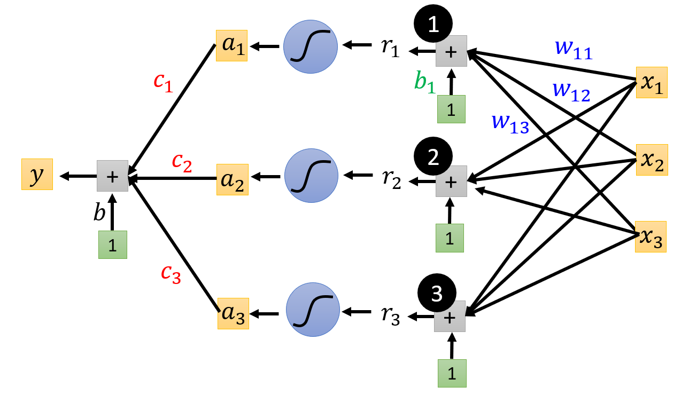

​	简单地说，通用近似定理定义了一个神经网络，只需要其中有一个包含足够多但有限数量神经元的隐藏层，在激活函数的作用下（书中说𝜙(⋅)是一个非常数、有界、单调递增的连续函数），我的理解是就是一个S型的函数，后面由*Kurt* *Hornik*证明通用近似定理并不依赖于特定的激活函数，而是由多层前馈网络结构所决定的，也就是说该定理适合所有激活函数，比如Relu函数，其实两个Relu函数便可以逼近sigmoid函数。

​	这里有一个有趣的问题就是，既然只有一个隐藏层的浅层神经网络可以拟合出任意函数，为什么现在的神经网络更加追求称为一个很高的瘦子（即追求深度），其中的一个解释就是如果只有一个隐藏层，那么其中的参数量会非常多，容易发现过拟合，当然现在层数很多的深层神经网络，纵然是作者自己有些原因都无法解释，这也是为什么现在很多人称深度学习为"玄学"，这里面更多地原因还需要在以后的学习中去体会。