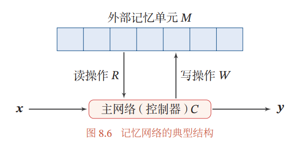
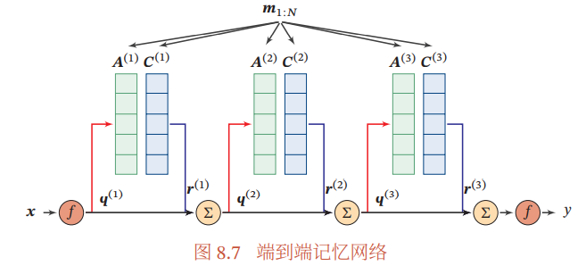
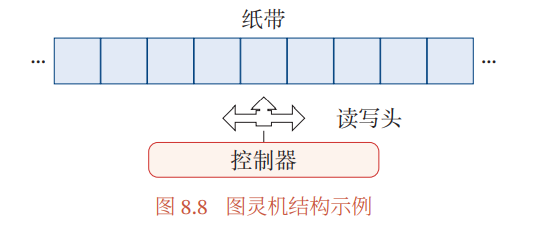
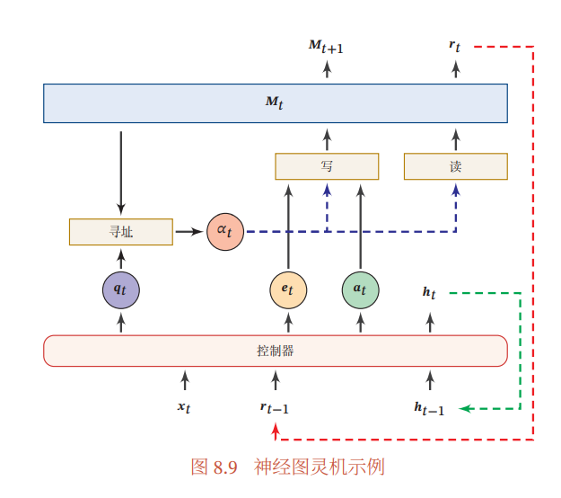
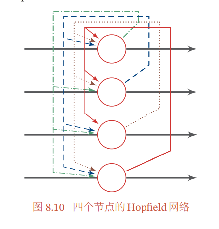
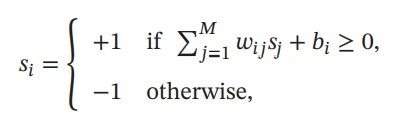
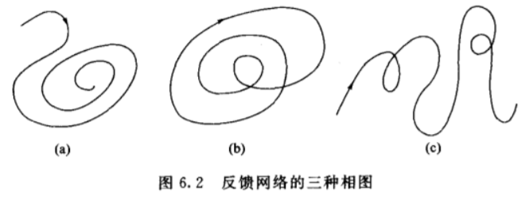
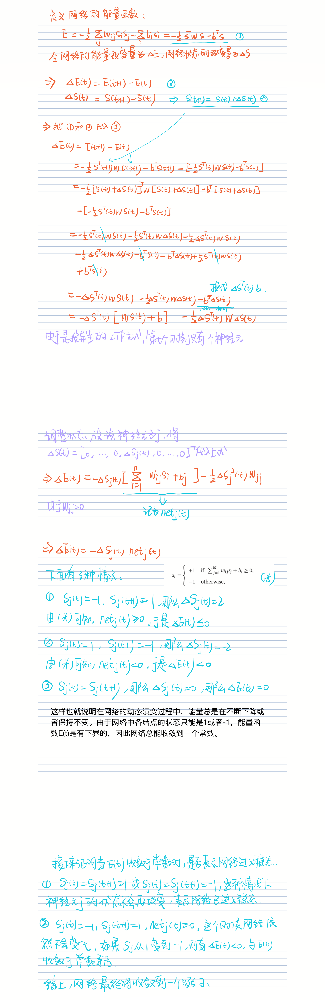
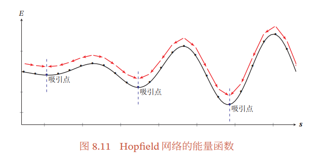
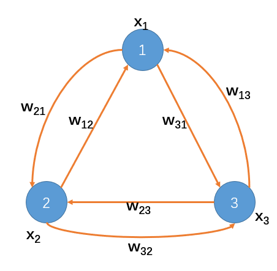

##### 8.4 人脑中的记忆

​	这个部分主要讲了生物神经网络中人脑记忆的特性。其中人脑记忆的一个特点就是记忆一般分为长期记忆和短期记忆。长期记忆体现为神经元之间的连接形态，更新速度比较慢，因此长期记忆可以类比于人工神经网络中的权重参数；短期记忆体现为神经元的活动，更新较快，可以类比于人工神经网络中的隐状态。

​	除此以外，人脑中还存在一个缓存，称为工作记忆，工作记忆是一个临时存储和处理系统，类似计算机的存储系统。

​	其次是联想记忆，联想记忆就是根据一种事物会想到其他与之有关系的事物。在计算机中，联想记忆是指一种可以通过内容匹配的方法进行寻址的信息存储方式。

​	之前介绍的LSTM（长短期记忆网络），其中的记忆单元可以类比于计算机中的寄存器，而外部记忆可以类比于计算机中的内存单元。

​	借鉴人脑中的工作记忆，于是在神经网络中引入了一个外部记忆单元来提高网络的容量。这种装备外部记忆的神经网络称为记忆增强神经网络。

##### 8.5 记忆增强神经网络

​	记忆网络的典型结构如图所示：

​	主网络(控制器)C：负责信息处理以及通过读写模块与外界进行交互。

​	外部记忆单元M：用来存储信息，一般分为很多个记忆片段，记忆片段用一组向量M表示，形如：$\pmb{M}=[\pmb{m_1},...,\pmb{m_N}]$​​。

​	读写模块（RW）：读取模块根据主网络生成查询向量$q_r$​​​，从外部记忆单元M中读取相应信息$r=R(M,q_r)$​​​，写入模块根据主网络生成查询向量$q_w$​​​和要写入的信息$a$​​​来更新外部记忆$M=W(M,q_w,a)$​​​

​	

------

​	这里实现要实现联想记忆功能，就需要按内容寻址进行定位，按内容寻址通常需要**注意力机制**来进行。

​	比如读取模型R的是实现方式为：
$$
\begin{align*}
&\pmb{r}=\sum_{n=1}^N\alpha_n\pmb{m}_n\\
&\alpha_n=softmax(s(\pmb{m}_n,\pmb{q}_r))
\end{align*}
$$
​	注意力机制的计算可以分为两步：一是在所有输入信息上计算注意力分布(也就是$\alpha_n$)，二是根据注意力分布来计算输入信息的加权平均(也就是$\pmb{r}$)。

​	这边的$s(\pmb{m}_n,\pmb{q}_r)$​​是注意力打分函数，用来计算每个输入向量和查询向量之间的相关性。类比于人类，就是说人可以在面对一堆信息时，可以选择关注一些信息，并且忽略另一些信息。

​	然后$m_n$​​根据其所得分数$\alpha_n$​进行加权平均，对输入的信息进行汇总，这就是软性注意力机制。

###### 8.5.1 端到端记忆网络

​	首先将需要存储的信息(一组向量)$m_{1:N}=\{m_1,...,m_N\}$​​划分成两个记忆片段$A=[a_1,...,a_N]$​​和$C=[c_1,...,c_N]$​​​​

​	主网络根据输入$\pmb{x}$生成$\pmb{q}$（即查询向量），并使用键值对注意力机制来从外部记忆中读取相关信息$\pmb{r}$​。

​	这里使用键值对机制，那么A就相当于Key，C就相当于Value，他们是一一对应的。再看公式：
$$
\pmb{r}=\sum_{n=1}^Nsoftmax(\pmb{a}^T_n\pmb{q})\pmb{c}_n
$$
​	首先就是根据$\pmb{q}$​和A（就是KEY）计算二者的相似度，也就是注意力的得分，再通过softmax函数对注意力得分进行数值转换，然后根据对应的权重系数对C（就是Value）进行加权求和。

整个过程如图所示：

​	

​	接下来是**多跳操作**，其实就是让上述过程多进行几次，在第k轮交互中，主网络根据上次从外部记忆中读取的信息$r^{(k-1)}$​，产生新的查询向量
$$
\pmb{q}^{(k)}=\pmb{r}^{(k-1)}+\pmb{q}^{(k-1)}
$$
​	第k轮交互后，主网络从外部记忆读取的信息应该为：
$$
\pmb{r}^{(k)}=\sum_{n=1}^Nsoftmax((\pmb{a}_n^{(k)})^T\pmb{q}^{(k)})\pmb{c}_n^{(k)}
$$
​	用图表示就是下面这个过程（用前一次所得到信息r产生新的查询向量q）：

###### 8.5.2 神经图灵机

​	首先是图灵机，**图灵机**是一种抽象的数学模型，可以用来模拟任何可计算问题。

​	从图中可以看出，图灵机主要由三个部分组成：

​	（1）首先是一条无限长的纸带，类似于计算机的内存，里面的一个个方格子可以存储数字，符号。

​	（2）然后是读写头，它可以做到从方格里读出数据，可以写入数据到方格里，也可以左右移动方格。

​	（3）最后是控制器，它可以根据机器指定的规则，决定读写头每一步的动作。

​	然后是神经图灵机，直接看图：

​	

​	它的主要过程就是通过控制器接收当前时刻的输入$\pmb{x}_t$、上一时刻的输出$\pmb{h}_{t-1}$和上一时刻从外部记忆读取的信息$\pmb{r}_{t-1}$,然后产生输出$\pmb{h}_t$。

​	同时，生成和读写外部记忆相关的三个向量：查询向量$\pmb{q}_t$、删除向量$\pmb{e}_t$和增加向量$\pmb{a}_t$，通过这三个向量对外部记忆$\pmb{M}_t$进行读写操作，同时生成新的读向量$\pmb{r}_t$和新的外部记忆$\pmb{M}_{t+1}$​。

​	这里的读操作和上面介绍的一样，通过注意力机制来进行基于内容的寻址，写操作则是分为两步：删除操作是根据注意力分布$\alpha_{t,n}$(t时刻的第n个记忆片段的得分)来按比例地在每个记忆片段中删除$\pmb{e}_t$，增加操作是根据注意力分布来按比例地给每个记忆片段加入$\pmb{a}_t$​。

​	具体过程如下：
$$
\pmb{m}_{t+1,n}=\pmb{m}_{t,n}(1-\alpha_{t,n}\pmb{e}_t)+\alpha_{t,n}\pmb{a}_t
$$
​	从前半部分删除需要删除的部分，从后半部分增加需要增加的。

##### 8.6 基于神经动力学的联想记忆

​	这个部分主要介绍一个经典的联想记忆模型Hopfield网络，与我们之前所学习的神经网络模型不同，之前我们所学习的神经网络都是作为机器学习模型的一个输入-输出的映射函数，而这里是作为一种记忆的存储和检索模型。

​	它的结构如图所示：

​	

​	Hopfield网络是一种循环神经网络网络模型，也可以理解为一种递归网络模型，它只有一层，并且所有神经元都互相连接，但和自身没有反馈连接，每个神经元既是输入单元也是输出单元，不同神经元之间的连接权重是对称的。

​	用公式来表示就是：
$$
\begin{align*}
&w_{ii}=0 \qquad\forall i\in[1,M]    \\
&w_{ij}=w_{ji}\quad\,\forall i\in[1,M]
\end{align*}
$$
​	第i个神经元的更新规则为（这里介绍的是离散Hopfield网络，也就是神经元的状态只有两种，+1和-1，分别表示神经元处于激活或者抑制的状态）：

​	Hopfield网络的更新方式有异步和同步两种方式，异步更新就是每次只更新一个神经元，同步更新就是一次更新所有的神经元。

​	比如四个节点的Hopfield网络，要更新$s_1$，通过公式就是先计算$w_{11}s_1+w_{12}s_2+w_{13}s_3+w_{14}s_4+b_1$，看这个结果是否是大于等于0的，如果是，那么$s_1=1$，如果不是，那么$s_1=-1$​。然后这个$s_1$又成为下一时刻的输入。

​	那么Hopfield网络是怎么工作的，比如现在给定$s(0)=[s_1(0),s_2(0),...,s_n(0)]^T$，将这个称为初态，那么经过Hopfield不断的更新，发现:
$$
\lim_{k\rightarrow\infty}s(k)
$$
不再改变，这个时候就进入了稳态。这个过程也就是Hopfield的价值所在。打个比方，你在大街上看见了一个人，你发现这人很眼熟，那么这开始的输入便是初态，经过你大脑的不断回想，你发现他是那个小学同学某某某，最后在你脑海的是他小学时候的那个样子，那这最后的结果便是稳态。同样也可以类比找极值的过程，刚开始所得到的值是初态，最后不断求解，最终得到了极值，也就是稳态。

​	**所以初态其实就是记忆样本的部分信息，而稳态就是记忆样本，hopfield通过部分样本信息不断联想，最终得到完整的样本信息。**

​	如何定义网络的稳定性？看下面这个图，图a网络从初态在有限次递归后其状态不再发生变化，就是说网络可以任一初态收敛到一个稳态，则该网络是稳定的；图b和图c网络都是不稳定的，因为是离散网络（只有1和-1两种情况），所以不管怎么发散，网络都不可能无限发散，图b是有限环网络（网络在有限的幅度内振荡），图c的现象称为混沌，它的变化状态既不重复也不停止，状态变化又无穷多个。

于是在Hopfield网络中稳定性指的是，从某一时刻开始，网络中的所有神经元状态不再改变，那么这个时候网络就是稳定的，并且这个稳定状态被称为网络的**吸引子**。如果把吸引子视为整个问题的解，那么从初态朝吸引子演变的过程就是求解计算的过程，如果把需要记忆的样本信息存储在不同的吸引子上，当输入含有部分记忆信息的样本时，整个网络的演变过程就是从部分信息寻找全部信息，即联想回忆的过程。

​	那么Hopfield如何保证网络的稳定性，也就是不管我输入的是什么，我总能收敛到一个吸引子。

​	这里借助Lyapunov 定理（李雅普诺夫）得到两个定理，分别是：

​	定理1：对于DHNN网络（也就是离散Hopfield网络），若按异步方式调整网络状态，且连接权矩阵W为对称阵，则对于任意初态，网络最终收敛到一个吸引子。

​	定理2：对于DHNN网，若按同步方式调整状态，且连接权矩阵W为非负定对称阵，则对于任意初态，网络最终收敛到一个吸引子。

​	这里给出证明过程（异步方式），同步方式证明方法是类似的：

​	书中给了能量函数的图片，展示了网络的演化方向：

​	

​	这个图也很明显的表现出来离散Hopfield网络的局限性，就是当记忆样本较接近时，网络不能始终回忆出正确的记忆。

​	接下来通过一个二分类问题展示Hopfield网络的应用，任务就是识别出是橘子还是苹果。通过传感器采集水果的特征，这里只采集三个维度（外形，质地，重量），看下面这个表格：

|      | 1     | 0      |
| ---- | ----- | ------ |
| 外形 | 圆形  | 椭圆形 |
| 质地 | 光滑  | 粗糙   |
| 重量 | <200g | >200g  |

​	标准的橘子：$x^{(1)}=[1\quad 0 \quad1]^T$，标准的苹果$x^{(2)}=[0\quad 1 \quad0]^T$   

​	第一步：设计Hopfield网络的结构，因为有三个特征，所以用三个神经元，如图

​	第二步：设计连接权矩阵，采用外积法，这里阈值设为0，也就是前面公式中的bi，并且$w_{ij}=w_{ji}$
$$
w_{ij}=\begin{cases} \sum_{l=1}^2(2x_i^{(l)}-1)(2x_j^{(l)}-1)\quad i\neq j\\ 
\qquad \qquad \qquad0 \qquad\qquad\,\,\,\quad i=j\end{cases}
$$
   比如我们计算$w_{12}=(2x_1^{(1)}-1)(2x_2^{(1)}-1)+(2x_1^{(2)}-1)(2x_2^{(2)}-1)=-1-1=-2=w_{21}$，最后计算得到权重矩阵
$$
W=
\left[\begin{matrix}
0 & -2 & 2\\
  -2 & 0 & -2\\
  2 & -2 & 0\\
\end{matrix}\right]
$$
​	第三步：测试，输入$[1\quad 1 \quad1]^T$，初始状态：
$$
\begin{cases}
x_1(0)=1\\
x_2(0)=1\\
x_3(0)=1\\
\end{cases}
$$
​	采用异步方式，设置更新次序为2->1->3，那么t=1时
$$
\begin{align*}
&x_2(1)=f(\sum_{j=1}^3w_{2j}x_j(0))=f(-2\times1+(-2)\times1)=f(-4)=0\\
&x_1(1)=x_1(0)=1\\
&x_3(1)=x_3(0)=1\\
\end{align*}
$$
​	t=2时，再算
$$
\begin{align*}
&x_2(2)=f(\sum_{j=1}^3w_{2j}x_j(1))=f(-2\times0+(-2)\times1)=f(-2)=0\\
&x_1(2)=x_1(1)=1\\
&x_3(2)=x_3(1)=1\\
\end{align*}
$$
​	t=3时，再算
$$
\begin{cases}
x_1(3)=1\\
x_2(3)=0\\
x_3(3)=1\\
\end{cases}
$$
​	最终就是
$$
\begin{cases}
x_1(0)=1\\
x_2(0)=1\\
x_3(0)=1\\
\end{cases}
\quad
\begin{cases}
x_1(1)=1\\
x_2(1)=0\\
x_3(1)=1\\
\end{cases}
\quad
\begin{cases}
x_1(2)=1\\
x_2(2)=0\\
x_3(2)=1\\
\end{cases}
\quad
\begin{cases}
x_1(3)=1\\
x_2(3)=0\\
x_3(3)=1\\
\end{cases}
$$
​	再往下算下去，还是不会改变，已经进入稳定状态，可以判断这个水果是橘子。
