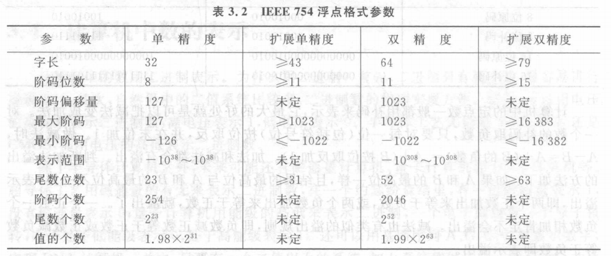
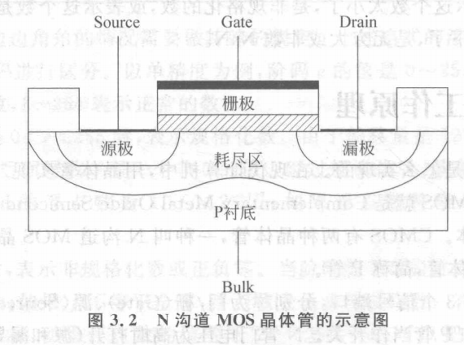
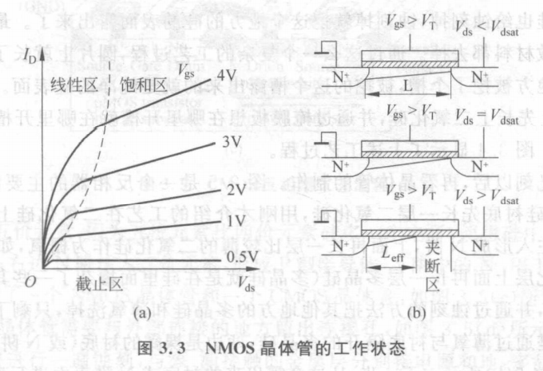
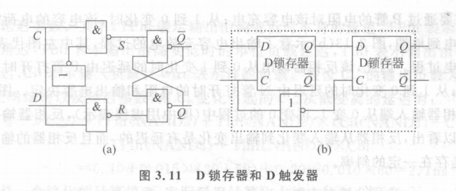

### 第2章 计算机系统结构基础

​	计算机系统设计三个层次：

| 应用、操作系统、编译系统    |
| :--------------------------------- |
| **计算机系统结构（性能、价格、功耗）** |
| **逻辑设计、电路设计、工艺制造**   |

#### 摩尔定律和工艺的发展

​	之前，集成电路厂商大约每18月能把工艺提高一代，现在工艺的发展速度变慢了，变成了2~3年才更新一代。

​	工艺技术与系统结构的关系经历了三个阶段：

- 晶体管不够用

- 集成电路的集成度越来越高，晶体管更多、更快、更省电

- 晶体管越来越多，但越来越难用，晶体管复杂、不快、不省电

  复杂：纳米级工艺的物理效应，比如线间耦合、片内漂移、可制作性等问题。

  不快：晶体管的驱动能力越来越小，连线电容相对较大、连线延迟越来越长。

  不省电：（1）工艺不断更新换代，漏电功能不断增加（纳米级工艺晶体管即使关掉之后还有漏电，有直流电流）（2）电压不再随着工艺的更新换代而更新降低（3）纳米级工艺连线功耗占主导，降低晶体管功耗对总功耗影响不大

  

​	CMOS工艺的物理极限（面临原子和量子机制的边界）

- 蚀刻问题越来越难处理（难以制造）
- 片内漂移问题突出（同一硅片内不同位置的晶体管都有不一样的电参数）
- 栅氧（晶体管中栅极下面作为绝缘层的氧化层）厚度难以继续降低

​	如何解决？新材料与新器件P14

#### 计算机应用的发展趋势

​	两台计算机。一台高端的，服务器更加普及，性能更高；一台融合了电脑、手机、电视等功能的手持普适信息终端。两者之间通过网络随时连接。（高和广两个特征）

#### 计算机系统结构发展趋势

1. 复杂度障碍

   工艺提供的晶体管变多了，但是更“难用”了，导致了设计周期和设计成本大幅度增加。芯片设计越来越强调结构的层次化、功能部件的模块化和分布化。（每个功能部件都相对简单，部件内部尽可能保持通信的局部性）

2. 主频障碍

   在高频状态下要求导线越细越短越好，这样才能减小导线分布电容等杂散干扰以保证CPU运算正确。因此制造工艺的限制，是主频发展的最大障碍之一。

3. 功耗障碍

   由于晶体管的特性，今后处理器的工作电压不会随着工艺的进步而降低，加上频率的提高，导致了处理器的功耗密度随集成度的增加而增加。并且纳米级工艺的漏电功耗也在不断增加。

4. 应用的变化

   设计专用处理器结合特定的算法设计，使芯片中多数面积和功耗都用来做运算以满足特定应用。

#### 多核结构的发展及其面临的问题

​	一开始的多核芯片：把好几个硅片封装在一起成为一个大芯片。

​	现在的多核芯片：采用比较复杂的少量核结构，其中的多核一般通过共享二级cache、三级cache或者内存进行互联和通信。

​	未来多核结构如何发展：第一把核越做越大；第二采用大量的基于分片的众核结构（可重构RAW处理器）；第三把通用处理器和协处理器集成在一起形成异构多核结构。

​	面临的问题：

1. 编程墙问题

   并行程序编程困难并且串行程序得不到加速，现在还没有一种结构方法可以在分布式结构和传统串行编程之间架设一座桥梁，以提高编程和调试的效率。

2. 带宽墙问题

   通俗地讲，就是访存速度跟不上CPU处理数据的速度。

   一些新型工艺速度：3D封装技术、光互连技术。

#### 衡量计算机的指标

1. 运行速度快不快

   影响计算机运算速度的因素主要有：算法和编译系统、体系结构、主频等。

   **算法和编译决定完成一个任务所需要的运算量；体系结构决定完成运算所需要的时钟周期数；主频决定每个时钟周期所需要的时间**。

2. 价格

3. 功耗

#### 性能评价

​	通过基准程序全面综合地评价计算机的性能。

### 第3章 二进制与逻辑电路

#### 计算机中数的表示

​	**定点数表示**：原码和补码，正数的原码和补码相同，负数的补码就是原码符号位不变，其余位取反后最低位加1。

​	计算机中的定点数一般用补码来表示，其优点就是可以把减法变成加法，即A-B=A+(B的负数)=A+(B按位取反加1)。

​	判断溢出的方法：两同号数相加，结果的符号位与参与运算的相反则溢出；两异号数相减，结果的符号位与被减数的符号位相反则溢出。

​	**浮点数表示**：IEEE 754标准

​	以单精度为例，阶码值的范围为0\~255之间，其中阶码位0和255时表示特殊的数，阶码在1~254之间表示正常的数。阶码为0时，表示非规格化数或者正负零，阶码为255时，表示无穷大或者非数。

#### MOS管工作原理

​	以上图为例，如果直接在源极和漏极之间加上电压，则不会有电流通过。（源和漏之间有一对正反相对的PN结）如果先在栅极上加上电压，因为栅氧化层是绝缘层，于是在P衬底形成一个电场，栅极上的正电压会把P衬底的电子吸引到栅氧化层底部，形成一个很薄的沟道电子层，相当于在源极和漏极之间架设了一座桥梁，这个时候在源极和漏极之间加上电压就会有电流通过。P管与此相反，加上电不通。

​	三种情况：截止区、线性区、饱和区

#### MOS基本工艺

​	光刻、晶体管制作、版图设计

#### 逻辑电路

​	组合逻辑电路和时序逻辑电路

​	下图是D锁存器和D触发器的原理图：

​	图(a)，在RS触发器前面加上两个与非门，用时钟C控制D输入。例如，C为0时，不管输入D如何变化，R和S都是1，于是最终输出都保持原来的状态。C为1时，R和S的值与D相同，相当于直通，这就是D锁存器的原理，时钟信号为高电平时输入，时钟信号为低电平时保持。

​	图(b)，将两个D锁存器串接起来构成D触发器，C为1时，第一个锁存器直通，第二个锁存器保持；C为0时，第一个锁存器保持，第二个锁存器直通；C从1变到0的时刻把D的值锁存起来。

​	当时钟信号为高时，主触发器就读取输入数据。同时，中间的反相器确保从触发器的时钟是低电平，以使得从触发器在主触发器的值改变的时候能够保证输出值稳定。（比如C=1,D=1，这个时候输入D传到主触发器Q=1，但这个时候从触发器C=0，因此输出不会因为D的改变而改变）在时钟信号变低之后，从触发器的时钟为高电平，数据值就直接传递（主触发器Q=1传到了从触发器的输入D，并且从触发器时钟为高电平，因此从触发器Q=1），但是这时候主触发器就给它一个稳定的输入（主触发器此时的输入D不管怎么改变，主触发器Q保持1）。当时钟信号从0变到1，从触发器会在主触发器的值改变之前保存数据。
