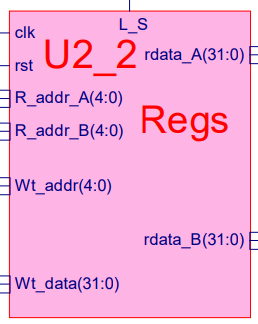
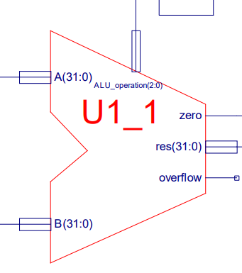
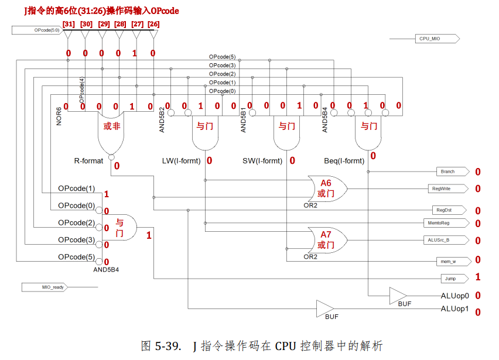

### CPU电路功能分析

#### 一、CPU控制器的工作过程

CPU控制器主要负责解析指令的操作码以及R型指令的功能码。

例如：R型指令格式如下:

|      OP       |  rs  |  rt  |  rd  | shamt |     funct     |
| :-----------: | :--: | :--: | :--: | :---: | :-----------: |
| 6位（操作码） | 5位  | 5位  | 5位  |  5位  | 6位（功能码） |

CPU控制器会对R型指令高六位操作码部分以及低六位功能码部分进行解析。

相关问题：R型指令的第六位功能码会对最终输出的ALU_Control产生影响，为什么其他类型的指令不会？

答：其他类型指令的操作码不同，会从电路上进行设计，从而屏蔽其他指令低六位对最终ALU_Control的影响。

#### 二、CPU数据通路电路分析

##### 1.分线器分离字段

根据指令格式通过分线器将低26位的字段分成不同的部分，分别传向不同的端口。

详细地，就像是将低26位inst_field(25:0)分离为inst_field(25:21)、inst_field(2016)、inst_field(15:11)、inst_field(15:0)这四个不同的字段。

##### 2.多路选择器

多路选择器的功能就是对于多个输入信号，通过控制信号从而选择指定的输入信号进行输出。

##### 3.寄存器堆

L_S为控制信号线，当且仅当L_S=1时，才能进行寄存器写操作。

clk为时钟信号，rst为复位reset信号（rst=1时，对寄存器堆中所有寄存器进行复位，复位至数值0）。

R_addr_A(4:0)、R_addr_B(4:0)为读地址线，Wt_addr(4:0)为写地址线，都为5位是因为寄存器堆总共有32个寄存器，所以寄存器的地址线位数为：log2 32 = 5位。

rdata_A(31:0)、rdata_B(31:0)为输出数据线，Wt_data(31:0)为写入数据线，都为32位是因为每个寄存器的位数为32位。

##### 4.高位扩展器

用于将16位的立即数扩展为32位，扩展的方法是将低16位的最高一位复制为16位，并将其作为高16位的值，形成一个32位数。

##### 5.ALU运算单元

操作数输入端口：A(31:0)和B(31:0)，这两个端口输入需要执行运算的操作数。

运算器控制信号端口：ALU_operation(2:0),不同的值代表不同的运算，这里ALU_operation(2:0)为三位，故可以执行8种不同的运算。具体如下表所示：

| ALU_operation(2:0) | 运算操作 |
| :----------------: | :------: |
|        000         |  AND 与  |
|        001         |  OR 或   |
|        010         |  ADD 加  |
|        011         | XOR 异或 |
|        100         | NOR 或非 |
|        101         | SRL 移位 |
|        110         |  SUB 减  |
|        111         |   全0    |

这里的ALU_operation(2:0)源于ALU_Control(2:0)信号，而ALU_Control(2:0)信号是由CPU控制器解析指令的高6位操作码和低6位功能码生成的。

运算结果输出端口：res(31:0),输出32位的运算结果。

运算结果标记位端口：zero、overflow。当运算结果为0时，zero状态位置为1，当结果溢出时，overflow置为1。

##### 6.PC程序计数器指针

PC程序计数器是用于存放下一条指令所在单元的地址的地方。

（1）PC计数器复位

当rst=1时，对PC计数器进行复位，此时PC计数器输出Q(31:0)为0。

（2）PC计数器赋值

当条件满足rst\==0,CE==1,并且clk时钟信号到来，将输入端D(31:0)的值写入到PC寄存器中，并且从Q(31:0)输出。

注意：PC计数器的值从Q(31:0)端口输出后，会将值传送至PC_out(31:0)端口，PC_out(31:0)输出后，将会传至指令存储器的地址输入端口，从而从ROM中读取相应的指令。

##### 7.转移指令对PC指针的更新

非转移指令：PC=PC+4

转移指令：

(1)相对偏移跳转：branch

例如此时branch指令的地址为0x30 对于指令branch 0x10

最终会跳转到：0x44（PC=PC+4+offset）

------

beq:branch if equal

beq rs,rt,offset

例如：beq r17,r18,0x202→000100 10001 10010 0000 0010 0000 0010

inst_field(25:0)=10001 10010 0000 0010 0000 0010

BEQ指令的操作码为000100，经CPU控制器解析后，设置Branch=1,Jump=0,ALU_Control(2:0)=110(减法操作)

R_addr_A=10001,rdata_A=R[17]

R_addr_B=10010,rdata_B=R[18]

ALU:操作数A=R[17],操作数B=R[18]

res=A-B=R[17]-R[18],如果R[17]==R[18]，res=zero,置zero=1，使得多路选择器MUXD4=1,最终PC=branch_pc=PC+4+Branch_offset,实现了偏移跳转。

(2)直接跳转:jump,call

例如jump 0x20 会跳转至0x20（PC=target）

jump指令的操作码为000010，经CPU控制器解析，置信号Jump=1,Branch=0,当jump=1时，Jump_addr直接传至PC

#### 三.总结

以下以一条C语言语句举例说明指令在CPU中的执行过程。

1.C语言语句：a=b+c;

2.汇编层次：

编译器将C语言编译器成汇编：

(1) lds r18,0x300    将变量b的值存入r18

(2) lds r19,0x304    将变量c的值存入r19

(3)add r17,r18,r19  将b和c的值相加存入r17

3.机器码层次：

以下只分析指令add r17,r18,r19 →000000 10010 10011 10001 00000 100000

4.机器码存入ROM指令存储器中，假设这条add指令存放在ROM中地址0x56处

5.计算机执行过程中，当PC=0x56时，取出这条add指令，传入CPU的inst_in(31:0)端口

6.此时inst_in(31:0)=000000 10010 10011 10001 00000 100000

7.经过分线器，使得OPcode(5:0)=000000 Fun(5:0)=100000

操作码经过CPU控制器解析后：(1)生成控制信号：Branch=0、RegWrite=1、RegDst=1、MemtoReg=0、ALUSrc_B=0、mem_w=0、Jump=0

(2)生成ALUop0和ALUop1信号，传送至下面的电路和Fun(5:0)功能码一起解析，最终生成ALU_Control(2:0)

8.控制信号传入Data_path，从而对add指令的低26位操作数进行解析

9.inst_field(25:0)=10010 10011 10001 00000 100000，通过三个分线器，得到R_addr_A=10010(使得rdata_A=r18=b),R_addr_B=10011(使得rdata_B=r19=c)

10.ALU(算术逻辑运算单元)

操作数A=b，操作数B=rdata_B=c，由于ALU_operation(2:0)=010，所以ALU对操作数A和B做加法运算，故res=b+c

11.由于MemtoReg=0，故Wt_data=res=b+c，又RegDst=1故Wt_addr(4:0)=10001=17，则会将b+c→r17,r17中的值就是b+c的值，即运算结果